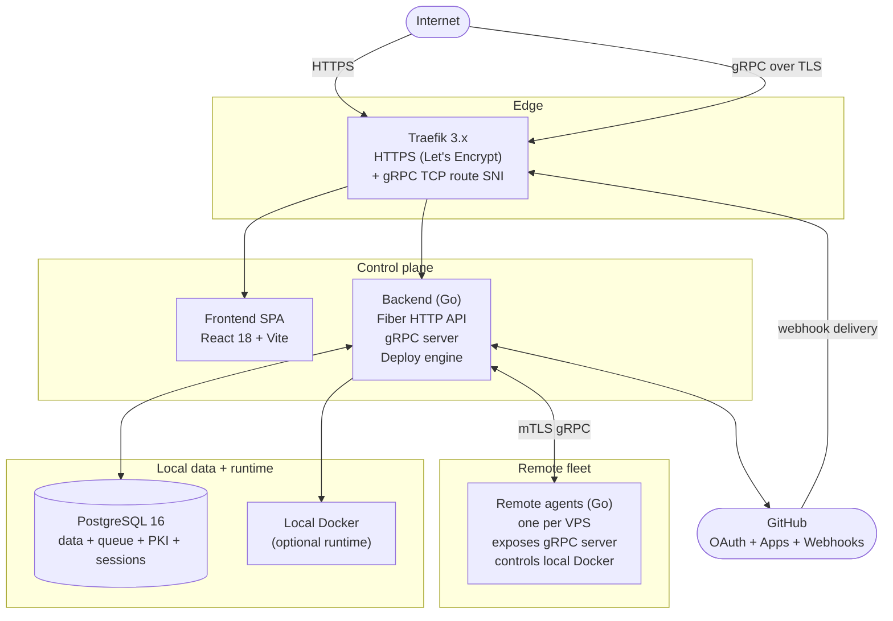
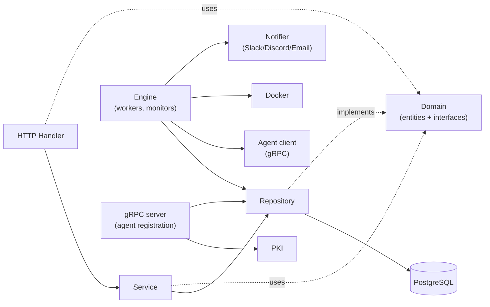
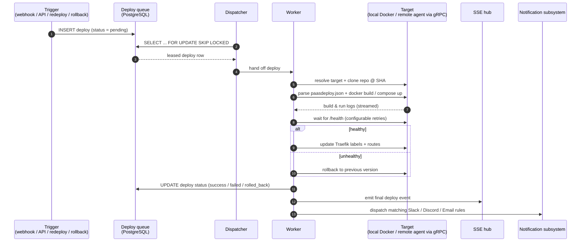

# FlowDeploy Architecture

This document describes the runtime architecture of FlowDeploy: how the
backend, the deploy engine, the remote agents, the database, the proxy and the
frontend collaborate to deliver applications from a Git push to a healthy
container.

> Companion documents:
>
> - [`GITHUB_INTEGRATION.md`](./GITHUB_INTEGRATION.md) — webhook architecture and OAuth flow
> - [`REMOTE_SSH_DEPLOY.md`](./REMOTE_SSH_DEPLOY.md) — agent-based remote deploy via gRPC
> - [`AUTO_DNS_CONFIGURATION.md`](./AUTO_DNS_CONFIGURATION.md) — Cloudflare automatic DNS
> - [`FEATURES_ROADMAP.md`](./FEATURES_ROADMAP.md) — current features and roadmap
> - [`K3S_DEPLOY_ROADMAP.md`](./K3S_DEPLOY_ROADMAP.md) — planned K3s runtime

## 1. High-level overview

FlowDeploy is a self-hosted PaaS distributed in three runtime processes plus
shared infrastructure:



### Runtime processes

| Process    | Path             | Purpose                                                                                          |
| ---------- | ---------------- | ------------------------------------------------------------------------------------------------ |
| `backend`  | `apps/backend`   | Fiber HTTP API, gRPC server (agent registration), deploy engine, SSE hub, monitors               |
| `agent`    | `apps/agent`     | gRPC server installed on each remote VPS; controls Docker, executes deploys, streams logs/stats  |
| `frontend` | `apps/frontend`  | Vite-built SPA served as static assets behind Traefik                                            |

### Shared infrastructure

- PostgreSQL 16 — application data, deploy queue, PKI material, sessions, audit log, notification rules
- Traefik 3.x — single ingress for HTTP, HTTPS (ACME) and TCP (gRPC passthrough to the backend gRPC port)
- Docker Engine 24+ — runs both the platform itself (compose stack) and deployed applications

## 2. Source layout

```
apps/
├── backend/
│   ├── cmd/api/                  # Process entrypoint
│   ├── internal/
│   │   ├── agentclient/          # gRPC client used to call remote agents
│   │   ├── agentdownload/        # Serves agent binaries for self-update
│   │   ├── cloudflare/           # Cloudflare API client (DNS automation)
│   │   ├── config/               # Env-based configuration
│   │   ├── crypto/               # Token & secret encryption
│   │   ├── database/             # pgx pool, transaction helpers
│   │   ├── di/                   # google/wire dependency injection
│   │   ├── domain/               # Domain models + repository interfaces
│   │   ├── engine/               # Deploy queue, dispatcher, workers, monitors
│   │   ├── ghclient/             # GitHub REST/GraphQL client
│   │   ├── github/               # OAuth + GitHub App + webhook orchestration
│   │   ├── grpcserver/           # Backend-side gRPC server (agent registration)
│   │   ├── handler/              # Fiber HTTP handlers (REST + SSE)
│   │   ├── middleware/           # Auth, CORS, request context
│   │   ├── migration/            # Embedded migration runner (golang-migrate)
│   │   ├── notification/         # Slack, Discord, Email senders
│   │   ├── password/             # bcrypt hashing for email auth
│   │   ├── pki/                  # Internal CA, agent certificates, rotation
│   │   ├── provisioner/          # SSH-based agent installation
│   │   ├── repository/           # PostgreSQL repositories
│   │   ├── requestctx/           # Per-request context + correlation IDs
│   │   ├── response/             # ApiEnvelope response writer
│   │   ├── server/               # Fiber bootstrap and route registration
│   │   ├── service/              # Business services (app, notification, audit)
│   │   ├── sysinfo/              # Platform host metrics
│   │   └── webhook/              # Inbound GitHub webhook ingestion
│   ├── gen/go/                   # Generated protobuf/gRPC code
│   └── migrations/               # 28+ SQL migrations (golang-migrate)
├── agent/
│   ├── cmd/agent/                # Agent entrypoint (flags + bootstrap)
│   └── internal/
│       ├── agent/                # Registration, heartbeat, version reporting
│       ├── cleanup/              # Scheduled Docker pruning
│       ├── deploy/               # Local deploy executor (clone, build, run)
│       └── grpcserver/           # gRPC handlers split by feature:
│                                 #   handlers_containers / _deploy / _exec
│                                 #   handlers_images / _resources / _update / _ssl
├── shared/                       # Zero-dependency Go primitives
│   └── pkg/
│       ├── compose/              # docker compose wrappers
│       ├── docker/               # Docker CLI client
│       ├── executor/             # Safe shell execution
│       ├── git/                  # Git clone/checkout helpers
│       ├── health/               # Health check probes
│       ├── lock/                 # File-based locking
│       ├── paths/                # Path resolution
│       ├── safepath/             # Path traversal guards
│       ├── traefik/              # Dynamic Traefik file provider
│       ├── cleaner/              # Docker resource cleanup
│       └── version/              # App version detection
└── proto/
    └── flowdeploy/v1/
        ├── agent.proto           # Agent service contract
        ├── server.proto          # Server/container messages
        ├── deploy.proto          # Deployment messages
        └── common.proto          # Shared messages
```

## 3. Layered architecture (backend)

The backend follows a strict downward dependency rule:



Rules enforced by `.cursor/rules/flowdeploy-backend-go.mdc`:

- Handlers are thin, parse input, call services and write `response.ApiEnvelope`.
- Services own business invariants and transactions.
- Repositories are the only layer touching SQL; queries are parameterized.
- Domain entities never import infrastructure packages.
- The deploy engine receives dependencies through structs (`WorkerDeps`).

## 4. Deploy engine

The deploy engine is the heart of the platform. It is fully PostgreSQL-driven
and concurrency-safe across replicas.

### Components (`apps/backend/internal/engine`)

| Component                | Responsibility                                                                                  |
| ------------------------ | ----------------------------------------------------------------------------------------------- |
| `queue.go`               | Insert/peek/claim deploys using `SELECT ... FOR UPDATE SKIP LOCKED`                             |
| `dispatcher.go`          | Polls the queue, leases work to workers, enforces concurrency limits                            |
| `worker.go`              | Executes a single deploy lifecycle: clone → build → run → health check → finalize/rollback     |
| `notifier.go`            | Bridges deploy events to the SSE hub and the notification subsystem                             |
| `health_monitor.go`      | Long-running monitor that polls container health and emits `health` SSE events                  |
| `stats_monitor.go`       | Polls per-container CPU/memory/network and emits `stats` SSE events                             |
| `system_stats_monitor.go`| Polls platform host metrics and emits `systemStats` SSE events                                  |
| `server_stats_monitor.go`| Polls remote agents (gRPC) for server metrics and emits `serverStats` SSE events                |
| `git_token_provider.go`  | Fetches short-lived GitHub App installation tokens for private repos                            |

### Lifecycle of a deploy



### Real-time events

The SSE hub at `GET /events/deploys` multiplexes a single, authenticated stream
to subscribed browsers. Event types currently emitted:

- `deploy` — step transitions, log lines, terminal status
- `health` — container health probes
- `stats` — per-container CPU/RAM/network usage
- `systemStats` — backend host metrics
- `serverStats` — remote VPS metrics (collected via gRPC)
- `provision` — SSH provisioning progress
- `agent_update` — agent self-update progress
- `resource` — generic invalidation hint for browsers

The frontend consumes the stream through `apps/frontend/src/services/sse.ts`
and uses TanStack Query's `setQueryData` / `invalidateQueries` to keep the UI
fresh **without polling**.

## 5. Remote agent and mTLS

Each remote VPS runs a single Go agent process exposing a gRPC server. The
backend connects as a client. All traffic uses mutual TLS:

- The backend operates an internal CA (`internal/pki`) and stores its key in
  the database (encrypted via `internal/crypto`).
- When a server is registered, the backend generates a per-agent certificate
  signed by the CA and ships it through the SSH provisioning script.
- The agent presents its certificate on every gRPC call; the backend pins both
  the CA and the server identity.

Traefik exposes the backend gRPC port through a TCP route with SNI routing so
that the same public hostname can serve HTTPS (frontend/API) and gRPC (agent
control plane).

The agent surface is split for clarity:

| File                          | Methods (RPCs)                                                               |
| ----------------------------- | ---------------------------------------------------------------------------- |
| `handlers_containers.go`      | List, start, stop, restart, remove, stream logs, stats                       |
| `handlers_deploy.go`          | Execute deploy, stream deploy logs, rollback                                 |
| `handlers_exec.go`            | Interactive `docker exec` over a bidirectional stream (PTY via `creack/pty`) |
| `handlers_images.go`          | List, remove and prune Docker images                                         |
| `handlers_resources.go`       | List networks, volumes, system info, stats                                   |
| `handlers_ssl.go`             | Inspect Traefik ACME storage, list certificates                              |
| `handlers_update.go`          | Receive a new agent binary and self-restart                                  |

See [`REMOTE_SSH_DEPLOY.md`](./REMOTE_SSH_DEPLOY.md) for the provisioning and
deploy flows, and [`apps/proto/flowdeploy/v1/agent.proto`](../apps/proto/flowdeploy/v1/agent.proto)
for the canonical contract.

## 6. Frontend architecture

The SPA is feature-sliced and built with Vite 6.

```
apps/frontend/src/
├── components/      # shadcn/ui primitives + shared widgets
├── features/        # one folder per business slice (apps, deploys, servers, ...)
├── hooks/           # cross-cutting React hooks (useSSE, useAuth, ...)
├── pages/           # route-level pages mounted by react-router
├── services/        # API client, SSE client, third-party integrations
├── styles/          # Tailwind layers and CSS variables (light/dark)
└── types/           # Cross-feature TypeScript types
```

Conventions enforced by `.cursor/rules/flowdeploy-frontend-react.mdc`:

- Strict TypeScript (no `any`, `readonly` props, `??` instead of `||`).
- Server state lives in TanStack Query; UI state lives in components.
- Every fetch goes through `services/api/client.ts`, returning `ApiEnvelope`.
- SSE events update React Query caches via `setQueryData`; no `refetchInterval`.
- Mobile-first Tailwind, `shadcn/ui` for primitives, `lucide-react` for icons.

## 7. Authentication and authorization

| Concern        | Implementation                                                                                         |
| -------------- | ------------------------------------------------------------------------------------------------------ |
| Sign-in        | GitHub OAuth (`internal/github`) **or** email/password with bcrypt (`internal/password`)              |
| Session        | Opaque token stored in HttpOnly, Secure, SameSite=Lax cookie; row in `sessions` table                  |
| Authorization  | Role on the user row (`admin`, `user`) + per-app ownership enforced by repositories and middleware     |
| API protection | Fiber middleware validates the session cookie, hydrates `requestctx` with user and role                |
| Local guard    | `RequireAdminForLocal` blocks non-admins from deploying onto the backend host                          |
| GitHub App     | Installation tokens minted on demand for private repo cloning                                          |

## 8. Persistence

- **Connection**: `jackc/pgx/v5` pool via `database/sql` adapter.
- **Migrations**: `golang-migrate` runs the embedded SQL files in
  `apps/backend/migrations/` on every backend start.
- **Patterns**:
  - All writes use parameterized queries (no string concatenation).
  - Soft deletes via `deleted_at` on app, server and notification tables.
  - Encrypted columns for sensitive payloads (env vars, OAuth tokens, agent keys).
  - JSON columns for flexible payloads (notification config, webhook payloads).

## 9. Observability

- Structured logging via `log/slog` with `lmittmann/tint` for human-friendly
  stdout in development.
- Each request gets a correlation ID through `internal/requestctx`, propagated
  to log records and to outbound gRPC metadata.
- Health endpoint at `GET /health`.
- Swagger UI generated by `swaggo/swag` (see `internal/handler/swagger.go`).
- SSE-based dashboards expose live metrics for the platform host and every
  registered VPS.

## 10. Security boundary summary

- mTLS between backend and every remote agent.
- Webhook signatures verified before any work is enqueued.
- Secrets at rest are AES-encrypted with a key supplied via environment.
- All shell calls go through `shared/pkg/executor` with explicit arg vectors
  (no `sh -c`, no string interpolation).
- CORS is allow-list based; wildcards are rejected at startup.
- Docker socket is never exposed to deployed containers; Traefik runs with the
  socket mounted read-only.

For the day-to-day rules followed by humans and AI agents, see
[`AGENTS.md`](../AGENTS.md) and the workspace rules under `.cursor/rules/`.
