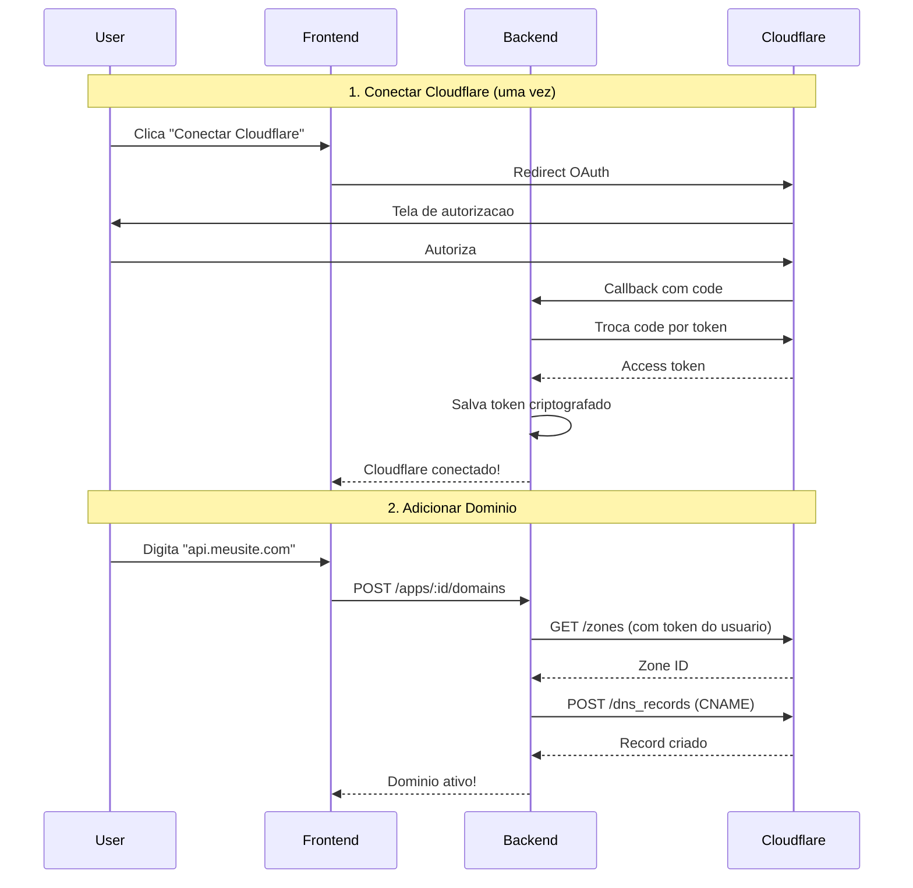

# FlowDeploy - Auto DNS Configuration (OAuth)

## Objetivo

1. Usuario conecta conta Cloudflare (igual GitHub)
2. Usuario digita o dominio
3. Sistema cria CNAME automaticamente no Cloudflare DO USUARIO
4. App fica acessivel no dominio

---

## Fluxo Completo



---

## 1. Configuracao do OAuth Cloudflare

### Criar OAuth App no Cloudflare

1. Acesse: https://dash.cloudflare.com/profile/api-tokens
2. Crie um "OAuth Application"
3. Configure:
   - **Redirect URI**: `https://flowdeploy.io/auth/cloudflare/callback`
   - **Scopes**: `zone:read`, `dns:edit`
4. Anote: `Client ID` e `Client Secret`

### Variaveis de Ambiente

```env
# Cloudflare OAuth
CLOUDFLARE_CLIENT_ID=xxxxx
CLOUDFLARE_CLIENT_SECRET=xxxxx
CLOUDFLARE_OAUTH_CALLBACK_URL=https://flowdeploy.io/auth/cloudflare/callback

# FlowDeploy Server
FLOWDEPLOY_SERVER_IP=203.0.113.50
FLOWDEPLOY_DEFAULT_DOMAIN=apps.flowdeploy.io
```

---

## 2. Modelo de Dados

```sql
-- Conexao Cloudflare do usuario
CREATE TABLE cloudflare_connections (
    id UUID PRIMARY KEY DEFAULT gen_random_uuid(),
    user_id UUID NOT NULL REFERENCES users(id) ON DELETE CASCADE,
    cloudflare_account_id VARCHAR(100) NOT NULL,
    cloudflare_email VARCHAR(255),
    access_token_encrypted TEXT NOT NULL,
    refresh_token_encrypted TEXT,
    token_expires_at TIMESTAMPTZ,
    created_at TIMESTAMPTZ DEFAULT NOW(),
    updated_at TIMESTAMPTZ DEFAULT NOW(),
    UNIQUE(user_id)
);

-- Dominios customizados
CREATE TABLE custom_domains (
    id UUID PRIMARY KEY DEFAULT gen_random_uuid(),
    app_id UUID NOT NULL REFERENCES apps(id) ON DELETE CASCADE,
    domain VARCHAR(255) NOT NULL UNIQUE,
    zone_id VARCHAR(100) NOT NULL,
    dns_record_id VARCHAR(100) NOT NULL,
    record_type VARCHAR(10) NOT NULL DEFAULT 'CNAME',
    status VARCHAR(50) NOT NULL DEFAULT 'active',
    created_at TIMESTAMPTZ DEFAULT NOW(),
    updated_at TIMESTAMPTZ DEFAULT NOW()
);

CREATE INDEX idx_cloudflare_connections_user ON cloudflare_connections(user_id);
CREATE INDEX idx_custom_domains_app ON custom_domains(app_id);
```

---

## 3. Backend - OAuth Handler

```go
// internal/handler/cloudflare_auth_handler.go

type CloudflareAuthHandler struct {
    clientID     string
    clientSecret string
    callbackURL  string
    connectionRepo domain.CloudflareConnectionRepository
    encryptor    *crypto.TokenEncryptor
    logger       *slog.Logger
}

// Inicia OAuth - redireciona para Cloudflare
func (h *CloudflareAuthHandler) StartOAuth(c *fiber.Ctx) error {
    user := GetUserFromContext(c)
    if user == nil {
        return response.Unauthorized(c, "not authenticated")
    }

    state := generateSecureState()
    // Salvar state na sessao para validar no callback

    authURL := fmt.Sprintf(
        "https://dash.cloudflare.com/oauth2/auth?client_id=%s&redirect_uri=%s&response_type=code&state=%s&scope=zone:read+dns:edit",
        h.clientID,
        url.QueryEscape(h.callbackURL),
        state,
    )

    return c.Redirect(authURL, fiber.StatusTemporaryRedirect)
}

// Callback OAuth - recebe code e troca por token
func (h *CloudflareAuthHandler) OAuthCallback(c *fiber.Ctx) error {
    code := c.Query("code")
    state := c.Query("state")

    // Validar state
    // ...

    // Trocar code por token
    token, err := h.exchangeCodeForToken(c.Context(), code)
    if err != nil {
        return c.Redirect("/settings?error=cloudflare_auth_failed", fiber.StatusTemporaryRedirect)
    }

    // Buscar info da conta Cloudflare
    accountInfo, err := h.getAccountInfo(c.Context(), token.AccessToken)
    if err != nil {
        return c.Redirect("/settings?error=cloudflare_account_error", fiber.StatusTemporaryRedirect)
    }

    // Criptografar tokens
    encryptedAccess, _ := h.encryptor.Encrypt(token.AccessToken)
    encryptedRefresh, _ := h.encryptor.Encrypt(token.RefreshToken)

    // Salvar conexao
    user := GetUserFromContext(c)
    connection := &domain.CloudflareConnection{
        UserID:                user.ID,
        CloudflareAccountID:   accountInfo.ID,
        CloudflareEmail:       accountInfo.Email,
        AccessTokenEncrypted:  encryptedAccess,
        RefreshTokenEncrypted: encryptedRefresh,
        TokenExpiresAt:        token.ExpiresAt,
    }

    if err := h.connectionRepo.Upsert(c.Context(), connection); err != nil {
        return c.Redirect("/settings?error=save_failed", fiber.StatusTemporaryRedirect)
    }

    return c.Redirect("/settings?cloudflare=connected", fiber.StatusTemporaryRedirect)
}

func (h *CloudflareAuthHandler) exchangeCodeForToken(ctx context.Context, code string) (*OAuthToken, error) {
    data := url.Values{}
    data.Set("grant_type", "authorization_code")
    data.Set("code", code)
    data.Set("client_id", h.clientID)
    data.Set("client_secret", h.clientSecret)
    data.Set("redirect_uri", h.callbackURL)

    resp, err := http.Post(
        "https://api.cloudflare.com/client/v4/user/tokens",
        "application/x-www-form-urlencoded",
        strings.NewReader(data.Encode()),
    )
    // Parse response...
}

// Desconectar Cloudflare
func (h *CloudflareAuthHandler) Disconnect(c *fiber.Ctx) error {
    user := GetUserFromContext(c)
    if err := h.connectionRepo.DeleteByUserID(c.Context(), user.ID); err != nil {
        return response.InternalError(c)
    }
    return response.OK(c, fiber.Map{"message": "disconnected"})
}
```

---

## 4. Backend - Domain Handler

```go
// internal/handler/domain_handler.go

type DomainHandler struct {
    appRepo        domain.AppRepository
    domainRepo     domain.CustomDomainRepository
    connectionRepo domain.CloudflareConnectionRepository
    encryptor      *crypto.TokenEncryptor
    serverIP       string
    defaultDomain  string
    logger         *slog.Logger
}

func (h *DomainHandler) AddDomain(c *fiber.Ctx) error {
    user := GetUserFromContext(c)
    appID := c.Params("id")

    var input struct {
        Domain string `json:"domain"`
    }
    if err := c.BodyParser(&input); err != nil {
        return response.BadRequest(c, "invalid request body")
    }

    // 1. Verifica se usuario tem Cloudflare conectado
    connection, err := h.connectionRepo.FindByUserID(c.Context(), user.ID)
    if err != nil {
        return response.BadRequest(c, "connect your Cloudflare account first")
    }

    // 2. Descriptografa token
    accessToken, err := h.encryptor.Decrypt(connection.AccessTokenEncrypted)
    if err != nil {
        return response.InternalError(c)
    }

    // 3. Cria cliente Cloudflare com token do usuario
    cfClient := cloudflare.NewClient(accessToken, h.logger)

    // 4. Normaliza dominio
    domainName := strings.ToLower(strings.TrimSpace(input.Domain))
    rootDomain := extractRootDomain(domainName)

    // 5. Busca Zone ID
    zoneID, err := cfClient.GetZoneID(c.Context(), rootDomain)
    if err != nil {
        h.logger.Error("zone not found", "domain", rootDomain, "error", err)
        return response.BadRequest(c, "domain not found in your Cloudflare account")
    }

    // 6. Cria registro DNS
    var recordID string
    if domainName == rootDomain {
        recordID, err = cfClient.CreateARecord(c.Context(), zoneID, domainName, h.serverIP)
    } else {
        recordID, err = cfClient.CreateCNAME(c.Context(), zoneID, domainName, h.defaultDomain)
    }

    if err != nil {
        h.logger.Error("failed to create DNS", "domain", domainName, "error", err)
        return response.BadRequest(c, "failed to create DNS record: "+err.Error())
    }

    // 7. Salva no banco
    customDomain := &domain.CustomDomain{
        AppID:       appID,
        Domain:      domainName,
        ZoneID:      zoneID,
        DNSRecordID: recordID,
        RecordType:  "CNAME",
        Status:      "active",
    }

    if err := h.domainRepo.Create(c.Context(), customDomain); err != nil {
        // Rollback
        _ = cfClient.DeleteRecord(c.Context(), zoneID, recordID)
        return response.InternalError(c)
    }

    return response.OK(c, customDomain)
}
```

---

## 5. API Endpoints

```
# OAuth Cloudflare
GET  /auth/cloudflare           # Inicia OAuth
GET  /auth/cloudflare/callback  # Callback OAuth
POST /auth/cloudflare/disconnect # Desconecta

# Status da conexao
GET  /api/cloudflare/status     # Verifica se conectado

# Dominios
GET    /paas-deploy/v1/apps/:id/domains           # Lista dominios
POST   /paas-deploy/v1/apps/:id/domains           # Adiciona dominio
DELETE /paas-deploy/v1/apps/:id/domains/:domainId # Remove dominio
```

---

## 6. Frontend - UI

### Settings Page - Conectar Cloudflare

```tsx
function CloudflareConnection() {
  const { data: status } = useCloudflareStatus();
  const disconnect = useDisconnectCloudflare();

  if (status?.connected) {
    return (
      <Card>
        <CardHeader>
          <CardTitle className="flex items-center gap-2">
            <Cloud className="h-5 w-5 text-orange-500" />
            Cloudflare Connected
          </CardTitle>
        </CardHeader>
        <CardContent>
          <div className="flex items-center justify-between">
            <div>
              <p className="font-medium">{status.email}</p>
              <p className="text-sm text-muted-foreground">
                Account ID: {status.accountId}
              </p>
            </div>
            <Button variant="outline" onClick={() => disconnect.mutate()}>
              Disconnect
            </Button>
          </div>
        </CardContent>
      </Card>
    );
  }

  return (
    <Card>
      <CardHeader>
        <CardTitle>Connect Cloudflare</CardTitle>
        <CardDescription>
          Connect your Cloudflare account to automatically configure DNS for
          custom domains.
        </CardDescription>
      </CardHeader>
      <CardContent>
        <Button asChild>
          <a href="/auth/cloudflare">
            <Cloud className="mr-2 h-4 w-4" />
            Connect Cloudflare
          </a>
        </Button>
      </CardContent>
    </Card>
  );
}
```

### Domain Manager

```tsx
function DomainManager({ appId }: Props) {
  const [domain, setDomain] = useState("");
  const { data: domains } = useDomains(appId);
  const { data: cfStatus } = useCloudflareStatus();
  const addDomain = useAddDomain(appId);
  const removeDomain = useRemoveDomain(appId);

  // Se Cloudflare nao conectado, mostra aviso
  if (!cfStatus?.connected) {
    return (
      <Card>
        <CardHeader>
          <CardTitle>Custom Domains</CardTitle>
        </CardHeader>
        <CardContent>
          <Alert>
            <Cloud className="h-4 w-4" />
            <AlertTitle>Cloudflare Required</AlertTitle>
            <AlertDescription>
              Connect your Cloudflare account to add custom domains.
              <Button variant="link" asChild className="p-0 h-auto ml-1">
                <Link to="/settings">Connect now</Link>
              </Button>
            </AlertDescription>
          </Alert>
        </CardContent>
      </Card>
    );
  }

  return (
    <Card>
      <CardHeader>
        <CardTitle className="flex items-center gap-2">
          <Globe className="h-5 w-5" />
          Custom Domains
        </CardTitle>
        <CardDescription>
          Add your domain. DNS will be configured automatically in your
          Cloudflare.
        </CardDescription>
      </CardHeader>

      <CardContent className="space-y-4">
        {/* Input */}
        <div className="flex gap-2">
          <Input
            placeholder="api.yourdomain.com"
            value={domain}
            onChange={(e) => setDomain(e.target.value)}
            onKeyDown={(e) => e.key === "Enter" && handleAdd()}
          />
          <Button
            onClick={() => {
              addDomain.mutate({ domain });
              setDomain("");
            }}
            disabled={addDomain.isPending || !domain.trim()}
          >
            {addDomain.isPending ? (
              <Loader2 className="h-4 w-4 animate-spin" />
            ) : (
              <Plus className="h-4 w-4" />
            )}
            Add
          </Button>
        </div>

        {/* Error */}
        {addDomain.isError && (
          <Alert variant="destructive">
            <AlertDescription>{addDomain.error?.message}</AlertDescription>
          </Alert>
        )}

        {/* Lista */}
        <div className="space-y-2">
          {domains?.map((d) => (
            <div
              key={d.id}
              className="flex items-center justify-between p-3 border rounded-lg"
            >
              <div className="flex items-center gap-3">
                <Badge variant="success">Active</Badge>
                <a
                  href={`https://${d.domain}`}
                  target="_blank"
                  rel="noopener noreferrer"
                  className="font-mono text-sm hover:underline flex items-center gap-1"
                >
                  {d.domain}
                  <ExternalLink className="h-3 w-3" />
                </a>
              </div>
              <Button
                variant="ghost"
                size="icon"
                onClick={() => removeDomain.mutate(d.id)}
              >
                <Trash2 className="h-4 w-4 text-destructive" />
              </Button>
            </div>
          ))}
        </div>
      </CardContent>
    </Card>
  );
}
```

---

## 7. SSL Automatico (Sem Certbot!)

### Como funciona

```
Usuario ----HTTPS----> Cloudflare ----HTTP----> FlowDeploy Server
         (SSL auto)                (interno)
```

### Por que NAO precisa Certbot/Let's Encrypt

Com `proxied: true` no registro DNS:

1. **Cloudflare Proxy ativo** - Todo trafego passa pelo Cloudflare
2. **SSL automatico** - Cloudflare gera certificado Edge gratuito
3. **Interno pode ser HTTP** - Conexao Cloudflare -> Servidor pode ser HTTP

### Modos SSL do Cloudflare

| Modo              | Cloudflare -> Servidor | Certificado no Servidor |
| ----------------- | ---------------------- | ----------------------- |
| **Flexible**      | HTTP                   | Nao precisa             |
| **Full**          | HTTPS                  | Self-signed OK          |
| **Full (Strict)** | HTTPS                  | Certificado valido      |

**Recomendacao: Use Flexible** - mais simples, nao precisa certificado no servidor.

### Configuracao no Cloudflare

O usuario precisa ter SSL/TLS configurado como "Flexible" ou "Full" no painel:

- Cloudflare Dashboard -> SSL/TLS -> Overview -> Flexible

### Codigo - Criar DNS com Proxy

```go
// Sempre criar com proxied: true para SSL automatico
record, err := cfClient.CreateRecord(ctx, zoneID, DNSRecord{
    Type:    "CNAME",
    Name:    "api.example.com",
    Content: "apps.flowdeploy.io",
    TTL:     1,       // Auto
    Proxied: true,    // IMPORTANTE: ativa Cloudflare Proxy = SSL gratis
})
```

### Traefik - Aceitar HTTP interno

```yaml
# docker-compose.yml do app
labels:
  - "traefik.http.routers.myapp.rule=Host(`api.example.com`)"
  - "traefik.http.routers.myapp.entrypoints=web" # HTTP interno
  # NAO precisa de certresolver!
```

### Resumo

| Componente              | Necessario? |
| ----------------------- | ----------- |
| Certbot                 | NAO         |
| Let's Encrypt           | NAO         |
| Certificado no servidor | NAO         |
| Cloudflare Proxy        | SIM         |
| SSL/TLS Flexible        | SIM         |

---

## 8. Seguranca

1. Tokens criptografados com AES-256
2. State parameter para prevenir CSRF
3. Refresh token para renovar acesso
4. Validar que usuario tem acesso a zone

---

## Estimativa

| Componente          | Tempo      |
| ------------------- | ---------- |
| OAuth Handler       | 1.5 dias   |
| Cloudflare Client   | 1 dia      |
| Migrations + Repos  | 0.5 dia    |
| Domain Handler      | 1 dia      |
| Frontend Settings   | 1 dia      |
| Frontend Domains    | 1 dia      |
| Traefik Integration | 0.5 dia    |
| Testes              | 1.5 dias   |
| **Total**           | **8 dias** |
