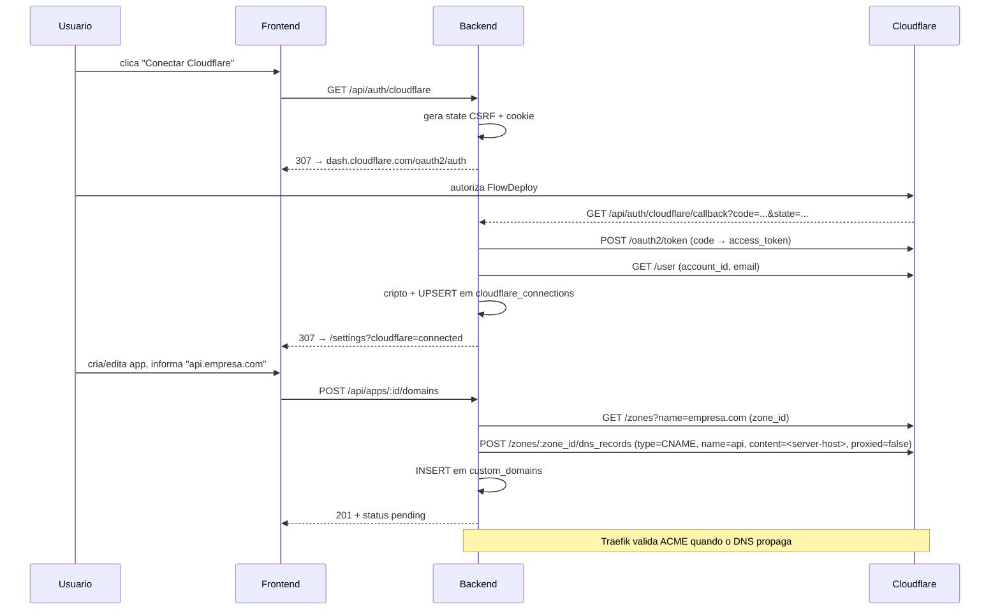

# DNS Automatico via Cloudflare (OAuth)

O FlowDeploy permite que cada usuario conecte sua propria conta Cloudflare e
automatize o cadastro de subdominios (CNAME) para os apps. Este documento
descreve como o fluxo funciona ponta a ponta, qual e a superficie de
configuracao e como diagnosticar problemas.

> Componentes envolvidos:
>
> - `apps/backend/internal/cloudflare/client.go` — cliente HTTP da API Cloudflare
> - `apps/backend/internal/handler/cloudflare_auth_handler.go` — fluxo OAuth + status
> - `apps/backend/internal/handler/domain_handler.go` — CRUD de dominios por app
> - Migracao `000007_cloudflare_domains` — tabelas `cloudflare_connections` e `custom_domains`

## 1. Visao geral

Objetivo:

1. Usuario conecta a conta Cloudflare via OAuth (mesma UX do GitHub).
2. Usuario digita o dominio que quer usar para o app (`api.empresa.com`).
3. Backend cria automaticamente o CNAME na zona Cloudflare do **proprio
   usuario**, apontando para o servidor do FlowDeploy.
4. App fica acessivel no dominio assim que a propagacao DNS conclui e o
   Traefik emite o certificado Let's Encrypt.

## 2. Fluxo OAuth + criacao de DNS


```mermaid
sequenceDiagram
  participant U as Usuario
  participant FE as Frontend
  participant BE as Backend
  participant CF as Cloudflare

  U->>FE: clica "Conectar Cloudflare"
  FE->>BE: GET /api/auth/cloudflare
  BE->>BE: gera state CSRF + cookie
  BE-->>FE: 307 → dash.cloudflare.com/oauth2/auth
  U->>CF: autoriza FlowDeploy
  CF-->>BE: GET /api/auth/cloudflare/callback?code=...&state=...
  BE->>CF: POST /oauth2/token (code → access_token)
  BE->>CF: GET /user (account_id, email)
  BE->>BE: cripto + UPSERT em cloudflare_connections
  BE-->>FE: 307 → /settings?cloudflare=connected

  U->>FE: cria/edita app, informa "api.empresa.com"
  FE->>BE: POST /api/apps/:id/domains
  BE->>CF: GET /zones?name=empresa.com  (zone_id)
  BE->>CF: POST /zones/:zone_id/dns_records (type=CNAME, name=api, content=<server-host>, proxied=false)
  BE->>BE: INSERT em custom_domains
  BE-->>FE: 201 + status pending
  Note over BE,CF: Traefik valida ACME quando o DNS propaga
```

## 3. Modelo de dados

### `cloudflare_connections`

Uma conexao por usuario (UNIQUE em `user_id`).

| Coluna                    | Descricao                                          |
| ------------------------- | -------------------------------------------------- |
| `id`                      | UUID                                               |
| `user_id`                 | FK -> `users` (ON DELETE CASCADE)                  |
| `cloudflare_account_id`   | id retornado pela API Cloudflare                   |
| `cloudflare_email`        | email do dono da conta                             |
| `access_token_encrypted`  | token AES-encriptado por `internal/crypto`         |
| `refresh_token_encrypted` | refresh token (quando aplicavel)                   |
| `token_expires_at`        | quando o token expira (nullable)                   |

### `custom_domains`

Um registro por (app, dominio).

| Coluna           | Descricao                                          |
| ---------------- | -------------------------------------------------- |
| `id`             | UUID                                               |
| `app_id`         | FK -> `apps` (ON DELETE CASCADE)                   |
| `domain`         | UNIQUE                                             |
| `zone_id`        | id da zona Cloudflare                              |
| `dns_record_id`  | id do registro Cloudflare (para update/delete)     |
| `record_type`    | default `CNAME`                                    |
| `status`         | `active`, `pending`, `error` (atualizado pelo backend) |

## 4. Configuracao de ambiente

Adicione no `.env` do backend:

```bash
# Cloudflare OAuth (criar OAuth Application em https://dash.cloudflare.com/)
CLOUDFLARE_OAUTH_CLIENT_ID=<client_id>
CLOUDFLARE_OAUTH_CLIENT_SECRET=<client_secret>
CLOUDFLARE_OAUTH_CALLBACK_URL=https://<deploy-host>/api/auth/cloudflare/callback

# Hostname publico do FlowDeploy (usado como destino do CNAME)
BACKEND_PUBLIC_HOST=deploy.example.com
```

> Sem essas variaveis o handler ainda registra as rotas, mas qualquer
> tentativa de OAuth retorna `503` com `cloudflare_oauth_disabled`.

## 5. Endpoints

| Metodo | Endpoint                                  | Descricao                                          |
| ------ | ----------------------------------------- | -------------------------------------------------- |
| `GET`  | `/api/auth/cloudflare`                    | Inicia o fluxo OAuth (gera state, redireciona)     |
| `GET`  | `/api/auth/cloudflare/callback`           | Recebe `code`, troca por token, salva conexao      |
| `POST` | `/api/auth/cloudflare/connect`            | Conecta com **API Token** (alternativa ao OAuth)   |
| `POST` | `/api/auth/cloudflare/disconnect`         | Remove a conexao do usuario                        |
| `GET`  | `/api/auth/cloudflare/status`             | Mostra se ha conexao ativa e metadados             |
| `GET`  | `/api/apps/:id/domains`                   | Lista dominios do app                              |
| `POST` | `/api/apps/:id/domains`                   | Cria CNAME automatico                              |
| `DELETE` | `/api/apps/:id/domains/:domainId`        | Remove CNAME do Cloudflare e da tabela             |

A alternativa **API Token** (`/connect`) e util para usuarios que preferem
nao usar OAuth (ex: contas Cloudflare for Teams). O token deve ter as
permissoes minimas: `Zone.DNS:Edit`, `Zone.Zone:Read`.

## 6. Conexao via API Token (sem OAuth)

```http
POST /api/auth/cloudflare/connect
Content-Type: application/json

{
  "apiToken": "<cloudflare-api-token>",
  "email": "ops@empresa.com"
}
```

O backend valida o token chamando `GET /user/tokens/verify` antes de
persistir, e armazena o token criptografado da mesma forma que o fluxo OAuth.

## 7. Resolucao de zona

Quando um dominio e criado, o backend determina a zona automaticamente:

1. Quebra o dominio em sufixos (`api.empresa.com` → `empresa.com`, `com`).
2. Para cada sufixo, chama `GET /zones?name=<sufixo>` na conta do usuario.
3. Usa a primeira zona encontrada. Se nenhuma zona corresponder, retorna
   erro `cloudflare_zone_not_found` para o frontend exibir.

## 8. Tipo do registro

- Por padrao, registros sao **CNAME** apontando para `BACKEND_PUBLIC_HOST`.
- Quando o apex (`empresa.com`) e usado, o backend cria registro `A` para o
  IP do backend (Cloudflare permite CNAME flattening em zonas com DNSSEC,
  mas preferimos `A` para evitar surpresas).
- O campo `proxied` e sempre `false` para nao interferir com o Let's Encrypt
  resolvido pelo Traefik.

## 9. Lifecycle de um dominio

```
created  ──►  CNAME criado em Cloudflare
              │
              ▼
pending  ──►  aguardando propagacao DNS + ACME
              │
              ▼
active   ──►  Traefik servindo TLS para o dominio
```

A coluna `status` e atualizada pela rotina de health do dominio (verifica
resolucao DNS + handshake TLS). Em caso de falha persistente, vira `error` e
fica visivel no painel.

## 10. Remocao

`DELETE /api/apps/:id/domains/:domainId`:

1. Chama `DELETE /zones/:zone_id/dns_records/:dns_record_id` no Cloudflare.
2. Remove a linha em `custom_domains`.
3. Atualiza a configuracao Traefik para parar de atender o dominio.

Falha na chamada Cloudflare nao bloqueia a remocao local, mas e logada para
permitir limpeza manual posterior.

## 11. Boas praticas

- Use sub-dominios dedicados (`api.empresa.com`) ao inves de apex sempre que
  possivel — propagam mais rapido e evitam impacto em DNS legado.
- Conecte a conta Cloudflare apenas com as permissoes necessarias (DNS
  Edit + Zone Read). Reveja periodicamente os tokens em
  `dash.cloudflare.com → Profile → API Tokens`.
- Para dominios corporativos com DNS gerenciado fora da Cloudflare, deixe a
  conexao desconectada e cadastre o CNAME manualmente apontando para o
  `BACKEND_PUBLIC_HOST`.

## 12. Solucao de problemas

| Sintoma                                              | Causa provavel                                          |
| ---------------------------------------------------- | ------------------------------------------------------- |
| `cloudflare_oauth_disabled`                          | Variaveis OAuth nao configuradas no backend             |
| `invalid_state`                                      | Cookie `cloudflare_oauth_state` expirou (TTL 10 min)    |
| `cloudflare_zone_not_found`                          | Dominio nao pertence a nenhuma zona da conta conectada  |
| `dns_record_already_exists`                          | Registro existente nao gerenciado pelo FlowDeploy       |
| Dominio `pending` por muito tempo                    | Propagacao DNS demorando ou registrar nao apontou DNS   |
| Erro 403 `Insufficient privileges`                   | API Token sem permissao `Zone.DNS:Edit`                 |
| Token rotacionado externamente                       | Chamada para o backend retorna 401; usuario reconecta   |

## 13. Onde mexer ao evoluir

| Mudanca                                  | Arquivos                                                 |
| ---------------------------------------- | -------------------------------------------------------- |
| Suporte a outro provedor (Route53, etc.) | abstrair `cloudflare.Client` em uma interface `dns.Provider` |
| Multiplas contas Cloudflare por usuario  | remover UNIQUE em `cloudflare_connections.user_id`       |
| Suporte a `proxied=true`                 | adicionar opcao na UI + atualizar `cloudflare/client.go` |
| Renovacao automatica de tokens           | implementar ciclo de refresh em `handler` + cron         |
