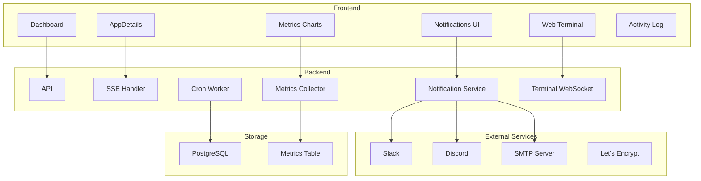

# FlowDeploy - Estudo de Features

## Estado Atual do Sistema

O FlowDeploy ja possui:

- Deploy automatizado via GitHub webhooks
- Monitoramento em tempo real (CPU, memoria, rede, PIDs)
- Logs streaming via SSE
- Rollback automatico
- Environment variables com suporte a secrets
- Health checks configuraveis
- Container control (start/stop/restart)

---

## Features Propostas

### Alta Prioridade - Quick Wins

#### 1. Sistema de Notificacoes

**Persona:** DevOps + Dev  
**Valor:** Alertas proativos sobre falhas de deploy, container down, health checks

```
Canais:
- Slack webhook
- Discord webhook
- Email (SMTP)
- Browser notifications (Web Push API)
```

**Implementacao:**

- Tabela `notification_channels` (type, config JSON, app_id nullable)
- Tabela `notification_rules` (event_type, channel_id, enabled)
- Service `NotificationService` que escuta eventos do SSE

---

#### 2. Metricas Historicas e Graficos

**Persona:** DevOps  
**Valor:** Visualizar tendencias de uso de recursos, identificar memory leaks, CPU spikes

```
Dados a armazenar:
- CPU % (media por minuto)
- Memory usage (media por minuto)
- Network I/O (acumulado por minuto)
- Request count (se tiver proxy metrics)
```

**Implementacao:**

- Tabela `app_metrics` (app_id, timestamp, cpu, memory, network_rx, network_tx)
- Job de agregacao a cada minuto
- Componente de graficos com Recharts ou Chart.js
- Retencao configuravel (7 dias default)

---

#### 3. Activity Log / Audit Trail

**Persona:** DevOps + Dev  
**Valor:** Rastreabilidade de quem fez o que, quando

```
Eventos a logar:
- Deploy triggered (manual/webhook)
- Container restart/stop/start
- Env var created/updated/deleted
- App settings changed
- Webhook configured
```

**Implementacao:**

- Tabela `activity_logs` (id, user_id, app_id, action, details JSONB, ip, timestamp)
- Middleware para capturar acoes automaticamente
- Timeline component no frontend

---

#### 4. Preview Deployments (Deploy por PR)

**Persona:** Dev  
**Valor:** Testar mudancas em ambiente isolado antes de merge

```
Fluxo:
1. PR aberto -> webhook dispara
2. Cria ambiente temporario (subdomain: pr-123.app.flowdeploy.io)
3. Deploy da branch do PR
4. PR fechado/merged -> cleanup automatico
```

**Implementacao:**

- Flag `is_preview` na tabela `apps`
- Tabela `preview_deployments` (pr_number, base_app_id, preview_app_id, status)
- GitHub webhook handler para eventos `pull_request`
- TTL para auto-cleanup (24h apos PR fechado)

---

### Media Prioridade - Funcionalidades Avancadas

#### 5. Terminal Web (Exec no Container)

**Persona:** Dev  
**Valor:** Debug em tempo real, executar comandos sem SSH

```
Tecnologia:
- WebSocket para terminal interativo
- xterm.js no frontend
- docker exec no backend
```

**Implementacao:**

- Endpoint WebSocket `/apps/:id/terminal`
- Timeout de sessao (30 min)
- Audit log de comandos executados
- Permissoes: apenas owner pode acessar

---

#### 6. Build Configuration Avancada

**Persona:** Dev  
**Valor:** Customizar processo de build sem modificar codigo

```
Opcoes:
- Dockerfile path customizado
- Build arguments (--build-arg)
- Target stage (multi-stage builds)
- Build cache toggle
```

**Implementacao:**

- Campos na tabela `apps`: dockerfile_path, build_args JSONB, target_stage
- UI para configurar no App Settings
- Passar para docker build command

---

#### 7. Scheduled Tasks (Cron Jobs)

**Persona:** Dev  
**Valor:** Executar tarefas periodicas (cleanup, reports, sync)

```
Exemplo:
- "*/5 * * * * /app/scripts/cleanup.sh"
- Executa dentro do container da app
```

**Implementacao:**

- Tabela `scheduled_tasks` (app_id, schedule, command, enabled, last_run, next_run)
- Worker dedicado para executar crons
- Logs de execucao separados
- UI para CRUD de tasks

---

#### 8. Custom Domains Management

**Persona:** DevOps  
**Valor:** Gerenciar dominios proprios com SSL automatico

```
Fluxo:
1. Usuario adiciona dominio
2. Sistema mostra DNS records necessarios
3. Valida DNS propagation
4. Let's Encrypt gera certificado
5. Traefik atualiza config
```

**Implementacao:**

- Tabela `custom_domains` (app_id, domain, verified, ssl_status, verified_at)
- Job de verificacao DNS
- Integracao com Let's Encrypt/ACME
- UI com status de verificacao

---

#### 9. Resource Limits Editaveis

**Persona:** DevOps  
**Valor:** Ajustar CPU/Memory sem editar codigo

```
Campos:
- Memory limit (128MB - 8GB)
- Memory reservation
- CPU limit (0.25 - 4 cores)
- CPU reservation
```

**Implementacao:**

- Campos no `config` JSONB da app
- UI com sliders/inputs
- Aplica no proximo deploy
- Warning se exceder limites do host

---

### Baixa Prioridade - Nice to Have

#### 10. Multi-Environment Support

**Persona:** DevOps + Dev  
**Valor:** Staging e Production separados, promote entre ambientes

```
Estrutura:
- App e um "projeto"
- Projeto tem N environments (staging, production)
- Cada environment tem suas env vars, domain, config
```

**Complexidade:** Alta - requer refatoracao do modelo de dados

---

#### 11. Database Provisioning

**Persona:** Dev  
**Valor:** Criar databases (Postgres, Redis, MySQL) com um clique

```
Implementacao:
- Templates Docker Compose para cada DB
- Injecao automatica de connection string nas env vars
- Backup automatico
```

**Complexidade:** Media-Alta

---

#### 12. Feature Flags Service

**Persona:** Dev  
**Valor:** Toggle features sem redeploy

```
API:
- GET /flags/:app_id -> lista de flags
- SDK client para apps consumirem
```

**Complexidade:** Media - requer SDK e UI

---

#### 13. Secrets Rotation

**Persona:** DevOps  
**Valor:** Rotacionar secrets automaticamente

```
Fluxo:
- Define rotation policy (30 dias)
- Notifica antes de expirar
- Gera novo secret
- Redeploy automatico
```

---

## Diagrama de Arquitetura das Features



---

## Matriz de Prioridade

| Feature             | Esforco | Impacto | ROI   |
| ------------------- | ------- | ------- | ----- |
| Notificacoes        | Medio   | Alto    | Alto  |
| Metricas Historicas | Medio   | Alto    | Alto  |
| Activity Log        | Baixo   | Medio   | Alto  |
| Preview Deployments | Alto    | Alto    | Medio |
| Terminal Web        | Medio   | Alto    | Alto  |
| Build Config        | Baixo   | Medio   | Alto  |
| Scheduled Tasks     | Medio   | Medio   | Medio |
| Custom Domains      | Alto    | Alto    | Medio |
| Resource Limits UI  | Baixo   | Medio   | Alto  |
| Multi-Environment   | Alto    | Alto    | Baixo |
| Database Provision  | Alto    | Medio   | Baixo |
| Feature Flags       | Medio   | Baixo   | Baixo |

---

## Recomendacao de Implementacao

**Fase 1 (Quick Wins):**

1. Activity Log - baixo esforco, alta rastreabilidade
2. Resource Limits UI - ja existe no backend, so precisa UI
3. Build Config avancada - baixo esforco, valor imediato

**Fase 2 (Core Features):**

4. Sistema de Notificacoes - Slack/Discord primeiro
5. Metricas Historicas - essencial para operacoes

**Fase 3 (Developer Experience):**

6. Terminal Web - diferencial competitivo
7. Scheduled Tasks - muito solicitado por devs
8. Preview Deployments - melhora workflow de PR

**Fase 4 (Enterprise):**

9. Custom Domains com SSL
10. Multi-Environment
