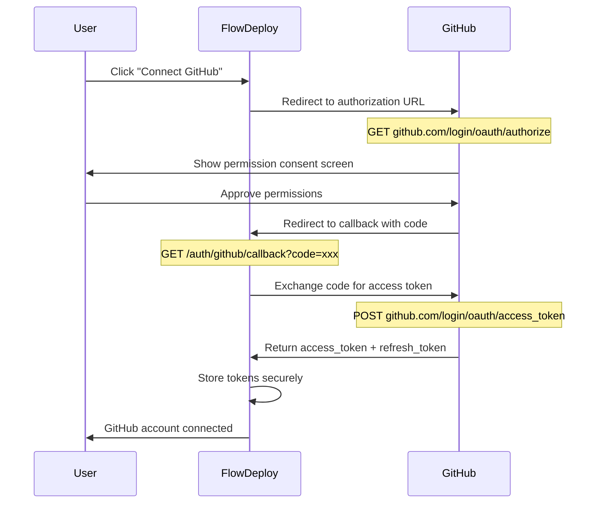
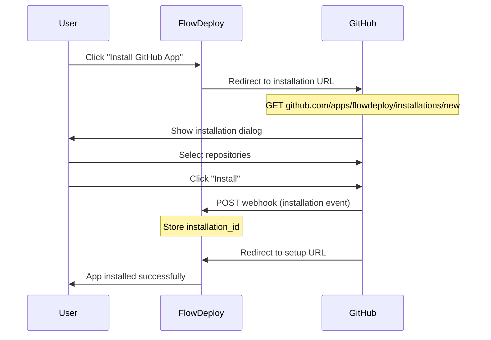

# GitHub Integration Architecture

This document describes the two-phase approach for GitHub webhook integration, designed to be **completely decoupled** from the deployment process.

## Architecture Principles

1. **Separation of Concerns**: Webhook management is independent of deployment
2. **Interface-Based Design**: Use abstractions to allow implementation swapping
3. **Optional Integration**: Deploy process works with or without automatic webhook setup
4. **No Breaking Changes**: Phase 2 implementation should not require changes to Phase 1 consumers

## System Overview

```
┌─────────────────────────────────────────────────────────────────────┐
│                         FlowDeploy System                           │
├─────────────────────────────────────────────────────────────────────┤
│                                                                     │
│  ┌──────────────┐    ┌──────────────────┐    ┌──────────────────┐  │
│  │              │    │                  │    │                  │  │
│  │  App Service │───▶│ Webhook Manager  │───▶│ GitHub Provider  │  │
│  │              │    │   (Interface)    │    │  (Interface)     │  │
│  └──────────────┘    └──────────────────┘    └──────────────────┘  │
│         │                                            │              │
│         │                                            ▼              │
│         │                                   ┌──────────────────┐   │
│         │                                   │  Phase 1: PAT    │   │
│         │                                   │  Phase 2: App    │   │
│         │                                   └──────────────────┘   │
│         │                                                          │
│         ▼                                                          │
│  ┌──────────────┐    ┌──────────────────┐                         │
│  │   Deploy     │◀───│ Webhook Handler  │◀── GitHub Push Event    │
│  │   Engine     │    │  (Receives)      │                         │
│  └──────────────┘    └──────────────────┘                         │
│                                                                     │
└─────────────────────────────────────────────────────────────────────┘
```

## Key Interfaces

### WebhookManager Interface

```go
// WebhookManager handles webhook lifecycle independent of provider
type WebhookManager interface {
    // Setup creates a webhook for the given repository
    // Returns webhook ID for future reference
    Setup(ctx context.Context, input WebhookSetupInput) (*WebhookResult, error)

    // Remove deletes a webhook from the repository
    Remove(ctx context.Context, input WebhookRemoveInput) error

    // Verify checks if webhook exists and is properly configured
    Verify(ctx context.Context, input WebhookVerifyInput) (*WebhookStatus, error)
}

type WebhookSetupInput struct {
    RepositoryURL string
    TargetURL     string
    Secret        string
    Events        []string
}

type WebhookResult struct {
    ID         string
    Provider   string // "github", "gitlab", etc.
    WebhookURL string
    Active     bool
}

type WebhookRemoveInput struct {
    RepositoryURL string
    WebhookID     string
}

type WebhookVerifyInput struct {
    RepositoryURL string
    WebhookID     string
}

type WebhookStatus struct {
    Exists     bool
    Active     bool
    LastPingAt *time.Time
    Error      string
}
```

### GitHubProvider Interface

```go
// GitHubProvider abstracts GitHub API operations
// Implementations: PATProvider (Phase 1), AppProvider (Phase 2)
type GitHubProvider interface {
    // CreateWebhook creates a webhook on the repository
    CreateWebhook(ctx context.Context, owner, repo string, config WebhookConfig) (*Webhook, error)

    // DeleteWebhook removes a webhook from the repository
    DeleteWebhook(ctx context.Context, owner, repo string, webhookID int64) error

    // GetWebhook retrieves webhook details
    GetWebhook(ctx context.Context, owner, repo string, webhookID int64) (*Webhook, error)

    // ListWebhooks lists all webhooks for a repository
    ListWebhooks(ctx context.Context, owner, repo string) ([]Webhook, error)
}
```

## Decoupling from Deploy Process

The deploy process must remain completely independent:

```
┌─────────────────────────────────────────────────────────────────┐
│                     DEPLOY PROCESS (Independent)                │
├─────────────────────────────────────────────────────────────────┤
│                                                                 │
│   Webhook Handler                    Deploy Engine              │
│   (Receives Events)                  (Executes Deploy)          │
│         │                                  ▲                    │
│         │                                  │                    │
│         └──────────────────────────────────┘                    │
│                    Creates Deployment                           │
│                    (via DeploymentRepository)                   │
│                                                                 │
│   NO DEPENDENCY ON:                                             │
│   - WebhookManager                                              │
│   - GitHubProvider                                              │
│   - PAT or GitHub App tokens                                    │
│                                                                 │
└─────────────────────────────────────────────────────────────────┘
```

### What Deploy Process Needs

1. **Webhook Handler**: Receives POST from GitHub, validates signature, creates deployment
2. **Webhook Secret**: For signature validation (environment variable)

### What Deploy Process Does NOT Need

1. GitHub PAT
2. GitHub App credentials
3. WebhookManager
4. Any knowledge of how webhooks were created

---

## Phase 1: Personal Access Token (PAT)

### Overview

Use a single PAT for personal/team repositories where the token owner has admin access.

### Scope

- Personal repositories
- Organization repositories where user is admin
- Team internal projects

### Implementation

```go
// PATProvider implements GitHubProvider using Personal Access Token
type PATProvider struct {
    client *http.Client
    token  string
}

func NewPATProvider(token string) *PATProvider {
    return &PATProvider{
        client: &http.Client{Timeout: 30 * time.Second},
        token:  token,
    }
}

func (p *PATProvider) CreateWebhook(ctx context.Context, owner, repo string, config WebhookConfig) (*Webhook, error) {
    // Uses existing github.Client implementation
    // Authorization: Bearer <PAT>
}
```

### Configuration

```bash
# .env
GITHUB_PAT=ghp_xxxxxxxxxxxxxxxxxxxx
GITHUB_WEBHOOK_SECRET=your-webhook-secret
GITHUB_WEBHOOK_URL=https://deploy.yourdomain.com/webhooks/github
```

### Required PAT Permissions

| Permission        | Scope        | Purpose                     |
| ----------------- | ------------ | --------------------------- |
| `repo`            | Full control | Access private repositories |
| `admin:repo_hook` | Full control | Create/delete webhooks      |

### Limitations

- Only works for repositories where PAT owner has admin access
- Single token for all operations
- Not suitable for multi-tenant with external users

### File Structure

```
internal/
├── github/
│   ├── provider.go          # GitHubProvider interface
│   ├── pat_provider.go      # Phase 1: PAT implementation
│   ├── client.go            # HTTP client (existing)
│   └── ...
├── webhook/
│   ├── manager.go           # WebhookManager interface
│   ├── github_manager.go    # GitHub implementation
│   └── ...
```

---

## Phase 2: GitHub App

### Overview

GitHub App allows external users to install the app on their repositories, granting specific permissions without sharing tokens.

### Scope

- Multi-tenant platform
- External users with their own repositories
- Production SaaS deployment

### How GitHub Apps Work

```
┌─────────────────────────────────────────────────────────────────┐
│                      GitHub App Flow                            │
├─────────────────────────────────────────────────────────────────┤
│                                                                 │
│  1. User clicks "Install App"                                   │
│           │                                                     │
│           ▼                                                     │
│  2. GitHub shows permission dialog                              │
│     - Repository webhooks (read/write)                          │
│     - Repository contents (read) [optional]                     │
│           │                                                     │
│           ▼                                                     │
│  3. User selects repositories                                   │
│           │                                                     │
│           ▼                                                     │
│  4. GitHub sends installation webhook to your app               │
│           │                                                     │
│           ▼                                                     │
│  5. Your app stores installation_id                             │
│           │                                                     │
│           ▼                                                     │
│  6. Your app generates installation token (expires 1h)          │
│           │                                                     │
│           ▼                                                     │
│  7. Use token to create webhooks on user's repos                │
│                                                                 │
└─────────────────────────────────────────────────────────────────┘
```

### Implementation

```go
// AppProvider implements GitHubProvider using GitHub App
type AppProvider struct {
    appID          int64
    privateKey     []byte
    installationID int64
    client         *http.Client
}

func NewAppProvider(appID int64, privateKey []byte) *AppProvider {
    return &AppProvider{
        appID:      appID,
        privateKey: privateKey,
        client:     &http.Client{Timeout: 30 * time.Second},
    }
}

// GetInstallationToken generates a short-lived token for API calls
func (p *AppProvider) GetInstallationToken(ctx context.Context, installationID int64) (string, error) {
    // 1. Create JWT signed with private key
    // 2. Call POST /app/installations/{installation_id}/access_tokens
    // 3. Return token (valid for 1 hour)
}

func (p *AppProvider) CreateWebhook(ctx context.Context, owner, repo string, config WebhookConfig) (*Webhook, error) {
    // 1. Get installation ID for this repo
    // 2. Generate installation token
    // 3. Create webhook using token
}
```

### Configuration

```bash
# .env
GITHUB_APP_ID=123456
GITHUB_APP_PRIVATE_KEY_PATH=/path/to/private-key.pem
# Or base64 encoded
GITHUB_APP_PRIVATE_KEY_BASE64=LS0tLS1CRUdJTi...

GITHUB_WEBHOOK_SECRET=your-webhook-secret
GITHUB_WEBHOOK_URL=https://deploy.yourdomain.com/webhooks/github
```

### Required App Permissions

| Permission          | Access       | Purpose                |
| ------------------- | ------------ | ---------------------- |
| Repository webhooks | Read & Write | Create/manage webhooks |
| Metadata            | Read         | Access repository info |

### Database Schema Addition

```sql
-- Store GitHub App installations
CREATE TABLE github_installations (
    id UUID PRIMARY KEY DEFAULT gen_random_uuid(),
    installation_id BIGINT NOT NULL UNIQUE,
    account_type VARCHAR(50) NOT NULL, -- 'User' or 'Organization'
    account_login VARCHAR(255) NOT NULL,
    account_id BIGINT NOT NULL,
    repositories JSONB, -- List of repos if not all
    permissions JSONB,
    created_at TIMESTAMPTZ NOT NULL DEFAULT NOW(),
    updated_at TIMESTAMPTZ NOT NULL DEFAULT NOW()
);

-- Link apps to installations
ALTER TABLE apps ADD COLUMN github_installation_id UUID REFERENCES github_installations(id);
```

### File Structure

```
internal/
├── github/
│   ├── provider.go          # GitHubProvider interface
│   ├── pat_provider.go      # Phase 1: PAT implementation
│   ├── app_provider.go      # Phase 2: GitHub App implementation
│   ├── jwt.go               # JWT generation for App auth
│   └── ...
├── webhook/
│   ├── manager.go           # WebhookManager interface
│   ├── github_manager.go    # GitHub implementation (uses provider)
│   └── ...
```

---

## Creating a GitHub App (Step-by-Step Guide)

This section provides detailed instructions for creating a GitHub App that allows third-party users to connect their GitHub accounts to FlowDeploy.

### Step 1: Access GitHub Developer Settings

1. Log in to your GitHub account
2. Click on your profile picture in the top-right corner
3. Select **Settings**
4. In the left sidebar, scroll down and click **Developer settings**
5. Click **GitHub Apps** in the left sidebar
6. Click the **New GitHub App** button

### Step 2: Configure Basic Information

Fill in the following fields:

| Field               | Value                                            | Description                                                           |
| ------------------- | ------------------------------------------------ | --------------------------------------------------------------------- |
| **GitHub App name** | `FlowDeploy`                                     | Unique name (max 34 characters). Users will see this when installing. |
| **Description**     | `Automatic deployments from GitHub repositories` | Optional but recommended for user clarity.                            |
| **Homepage URL**    | `https://your-domain.com`                        | Your FlowDeploy dashboard URL.                                        |

### Step 3: Configure Callback URLs

These URLs handle the OAuth flow when users connect their GitHub accounts:

| Field                    | Value                                                        | Purpose                           |
| ------------------------ | ------------------------------------------------------------ | --------------------------------- |
| **Callback URL**         | `https://your-domain.com/auth/github/callback`               | Receives OAuth authorization code |
| **Setup URL** (optional) | `https://your-domain.com/auth/github/setup`                  | Redirect after app installation   |
| **Webhook URL**          | `https://your-domain.com/paas-deploy/v1/webhooks/github/app` | Receives installation events      |

> **Note**: You can add up to 10 callback URLs for different environments (development, staging, production).

### Step 4: Configure Webhook Settings

| Field              | Value                                                        |
| ------------------ | ------------------------------------------------------------ |
| **Webhook URL**    | `https://your-domain.com/paas-deploy/v1/webhooks/github/app` |
| **Webhook secret** | Generate with `openssl rand -hex 32`                         |
| **Active**         | Checked                                                      |

Subscribe to the following events:

- `installation` - When users install/uninstall the app
- `installation_repositories` - When users change repository access
- `push` - When code is pushed to repositories

### Step 5: Configure Permissions

Select the minimum required permissions:

#### Repository Permissions

| Permission          | Access       | Required        | Purpose                               |
| ------------------- | ------------ | --------------- | ------------------------------------- |
| **Contents**        | Read         | Yes             | Clone repositories for deployment     |
| **Metadata**        | Read         | Yes (automatic) | Access basic repository information   |
| **Webhooks**        | Read & Write | Yes             | Create and manage deployment webhooks |
| **Pull requests**   | Read         | Optional        | Deploy on PR events (future feature)  |
| **Commit statuses** | Read & Write | Optional        | Report deployment status on commits   |

#### Account Permissions (User Authorization)

| Permission          | Access | Required | Purpose                              |
| ------------------- | ------ | -------- | ------------------------------------ |
| **Email addresses** | Read   | Yes      | Identify user and send notifications |

### Step 6: Configure Installation Options

| Option                                      | Recommended Value | Description                      |
| ------------------------------------------- | ----------------- | -------------------------------- |
| **Where can this GitHub App be installed?** | Any account       | Allows external users to install |
| **Request user authorization (OAuth)**      | Checked           | Required for user authentication |
| **Enable Device Flow**                      | Unchecked         | Not needed for web apps          |

### Step 7: Create the App

1. Click **Create GitHub App**
2. You will be redirected to your new app's settings page
3. Note the **App ID** displayed at the top - you'll need this

### Step 8: Generate Private Key

1. Scroll down to the **Private keys** section
2. Click **Generate a private key**
3. A `.pem` file will be downloaded automatically
4. Store this file securely - it's required for API authentication

```bash
# Store the private key securely
mkdir -p /etc/flowdeploy/keys
mv ~/Downloads/flowdeploy.*.private-key.pem /etc/flowdeploy/keys/github-app.pem
chmod 600 /etc/flowdeploy/keys/github-app.pem
```

### Step 9: Generate Client Secret

1. In the app settings, scroll to **Client secrets**
2. Click **Generate a new client secret**
3. Copy and store this secret immediately - it won't be shown again

### Step 10: Configure Environment Variables

Add the following to your `.env` file:

```bash
# GitHub App Configuration
GITHUB_APP_ID=123456
GITHUB_APP_NAME=FlowDeploy
GITHUB_CLIENT_ID=Iv1.xxxxxxxxxxxxxxxxxx
GITHUB_CLIENT_SECRET=xxxxxxxxxxxxxxxxxxxxxxxxxxxxxxxxxxxxxxxx
GITHUB_APP_PRIVATE_KEY_PATH=/etc/flowdeploy/keys/github-app.pem
# Or use base64 encoded key
# GITHUB_APP_PRIVATE_KEY_BASE64=LS0tLS1CRUdJTiBSU0EgUFJJVkFURSBLRVktLS0tLQ...

# Webhook Configuration
GITHUB_WEBHOOK_SECRET=your-webhook-secret-from-step-4
GITHUB_WEBHOOK_URL=https://your-domain.com/paas-deploy/v1/webhooks/github

# OAuth Configuration
GITHUB_OAUTH_CALLBACK_URL=https://your-domain.com/auth/github/callback
```

---

## OAuth Flow for Third-Party Users

This section describes how external users connect their GitHub accounts to FlowDeploy.

### User Authorization Flow



### App Installation Flow



### Authorization URL Construction

```go
func (h *AuthHandler) GetAuthorizationURL(state string) string {
    params := url.Values{
        "client_id":    {h.config.GitHub.ClientID},
        "redirect_uri": {h.config.GitHub.CallbackURL},
        "scope":        {"user:email"},
        "state":        {state}, // CSRF protection
    }
    return "https://github.com/login/oauth/authorize?" + params.Encode()
}
```

### Token Exchange

```go
func (h *AuthHandler) ExchangeCodeForToken(ctx context.Context, code string) (*TokenResponse, error) {
    payload := map[string]string{
        "client_id":     h.config.GitHub.ClientID,
        "client_secret": h.config.GitHub.ClientSecret,
        "code":          code,
    }

    resp, err := h.httpClient.PostJSON(
        "https://github.com/login/oauth/access_token",
        payload,
        map[string]string{"Accept": "application/json"},
    )
    if err != nil {
        return nil, fmt.Errorf("token exchange failed: %w", err)
    }

    return &TokenResponse{
        AccessToken:  resp.AccessToken,
        RefreshToken: resp.RefreshToken,
        ExpiresIn:    resp.ExpiresIn,
        TokenType:    resp.TokenType,
    }, nil
}
```

---

## Authentication API Endpoints

### OAuth Endpoints

```
GET  /auth/github              # Initiate OAuth flow
GET  /auth/github/callback     # Handle OAuth callback
POST /auth/github/refresh      # Refresh access token
DELETE /auth/github            # Disconnect GitHub account
```

### Installation Endpoints

```
GET  /auth/github/install      # Redirect to GitHub App installation
POST /paas-deploy/v1/webhooks/github/app  # Receive installation webhooks
```

### User Repository Endpoints

```
GET  /api/user/github/repos    # List user's accessible repositories
GET  /api/user/github/orgs     # List user's organizations
GET  /api/user/github/status   # Check GitHub connection status
```

### Endpoint Implementation Examples

#### Initiate OAuth Flow

```go
// GET /auth/github
func (h *AuthHandler) InitiateOAuth(c *fiber.Ctx) error {
    // Generate CSRF state token
    state := generateSecureToken(32)

    // Store state in session/cookie for validation
    c.Cookie(&fiber.Cookie{
        Name:     "github_oauth_state",
        Value:    state,
        HTTPOnly: true,
        Secure:   true,
        SameSite: "Lax",
        MaxAge:   600, // 10 minutes
    })

    authURL := h.getAuthorizationURL(state)
    return c.Redirect(authURL, fiber.StatusTemporaryRedirect)
}
```

#### Handle OAuth Callback

```go
// GET /auth/github/callback
func (h *AuthHandler) HandleCallback(c *fiber.Ctx) error {
    code := c.Query("code")
    state := c.Query("state")

    // Validate CSRF state
    storedState := c.Cookies("github_oauth_state")
    if state != storedState {
        return fiber.NewError(fiber.StatusBadRequest, "invalid state parameter")
    }

    // Exchange code for tokens
    tokens, err := h.exchangeCodeForToken(c.Context(), code)
    if err != nil {
        return fiber.NewError(fiber.StatusBadRequest, "failed to exchange code")
    }

    // Get user info from GitHub
    user, err := h.getGitHubUser(c.Context(), tokens.AccessToken)
    if err != nil {
        return fiber.NewError(fiber.StatusBadRequest, "failed to get user info")
    }

    // Store connection in database
    err = h.storeGitHubConnection(c.Context(), GitHubConnection{
        UserID:         getCurrentUserID(c),
        GitHubUserID:   user.ID,
        GitHubUsername: user.Login,
        AccessToken:    encrypt(tokens.AccessToken),
        RefreshToken:   encrypt(tokens.RefreshToken),
        ExpiresAt:      time.Now().Add(time.Duration(tokens.ExpiresIn) * time.Second),
    })
    if err != nil {
        return fiber.NewError(fiber.StatusInternalServerError, "failed to store connection")
    }

    // Clear state cookie
    c.Cookie(&fiber.Cookie{
        Name:   "github_oauth_state",
        Value:  "",
        MaxAge: -1,
    })

    // Redirect to dashboard
    return c.Redirect("/dashboard?github=connected", fiber.StatusTemporaryRedirect)
}
```

#### List User Repositories

```go
// GET /api/user/github/repos
func (h *AuthHandler) ListRepositories(c *fiber.Ctx) error {
    userID := getCurrentUserID(c)

    // Get stored connection
    conn, err := h.getGitHubConnection(c.Context(), userID)
    if err != nil {
        return fiber.NewError(fiber.StatusNotFound, "GitHub not connected")
    }

    // Check if token needs refresh
    if time.Now().After(conn.ExpiresAt) {
        conn, err = h.refreshAccessToken(c.Context(), conn)
        if err != nil {
            return fiber.NewError(fiber.StatusUnauthorized, "token refresh failed")
        }
    }

    // Fetch repositories from GitHub
    repos, err := h.githubClient.ListUserRepos(c.Context(), decrypt(conn.AccessToken))
    if err != nil {
        return fiber.NewError(fiber.StatusBadGateway, "failed to fetch repositories")
    }

    return c.JSON(fiber.Map{
        "success": true,
        "data":    repos,
    })
}
```

---

## Database Schema for GitHub Connections

### GitHub Connections Table

Stores OAuth tokens and user connections:

```sql
-- Store GitHub OAuth connections for users
CREATE TABLE github_connections (
    id UUID PRIMARY KEY DEFAULT gen_random_uuid(),
    user_id UUID NOT NULL REFERENCES users(id) ON DELETE CASCADE,
    github_user_id BIGINT NOT NULL,
    github_username VARCHAR(255) NOT NULL,
    github_email VARCHAR(255),
    avatar_url VARCHAR(500),
    access_token_encrypted TEXT NOT NULL,
    refresh_token_encrypted TEXT,
    token_expires_at TIMESTAMPTZ,
    scopes TEXT[], -- Array of granted scopes
    connected_at TIMESTAMPTZ NOT NULL DEFAULT NOW(),
    updated_at TIMESTAMPTZ NOT NULL DEFAULT NOW(),

    CONSTRAINT unique_user_github UNIQUE (user_id),
    CONSTRAINT unique_github_user UNIQUE (github_user_id)
);

-- Index for lookups
CREATE INDEX idx_github_connections_user_id ON github_connections(user_id);
CREATE INDEX idx_github_connections_github_user_id ON github_connections(github_user_id);

-- Trigger for updated_at
CREATE TRIGGER update_github_connections_updated_at
    BEFORE UPDATE ON github_connections
    FOR EACH ROW
    EXECUTE FUNCTION update_updated_at_column();
```

### GitHub Installations Table

Stores GitHub App installations:

```sql
-- Store GitHub App installations
CREATE TABLE github_installations (
    id UUID PRIMARY KEY DEFAULT gen_random_uuid(),
    installation_id BIGINT NOT NULL UNIQUE,
    account_type VARCHAR(50) NOT NULL CHECK (account_type IN ('User', 'Organization')),
    account_id BIGINT NOT NULL,
    account_login VARCHAR(255) NOT NULL,
    target_type VARCHAR(50) NOT NULL, -- 'all' or 'selected'
    repository_selection VARCHAR(50), -- 'all' or 'selected'
    repositories JSONB DEFAULT '[]', -- List of repo IDs if selected
    permissions JSONB NOT NULL DEFAULT '{}',
    events JSONB NOT NULL DEFAULT '[]',
    suspended_at TIMESTAMPTZ,
    suspended_by VARCHAR(255),
    created_at TIMESTAMPTZ NOT NULL DEFAULT NOW(),
    updated_at TIMESTAMPTZ NOT NULL DEFAULT NOW()
);

-- Index for lookups
CREATE INDEX idx_github_installations_account ON github_installations(account_id, account_login);

-- Trigger for updated_at
CREATE TRIGGER update_github_installations_updated_at
    BEFORE UPDATE ON github_installations
    FOR EACH ROW
    EXECUTE FUNCTION update_updated_at_column();
```

### Link Installations to Users

```sql
-- Link users to their GitHub App installations
ALTER TABLE github_connections
ADD COLUMN installation_id UUID REFERENCES github_installations(id);

-- Link apps to installations for deployment
ALTER TABLE apps
ADD COLUMN github_installation_id UUID REFERENCES github_installations(id);
```

### Migration File Example

Create file `migrations/000006_github_oauth.up.sql`:

```sql
-- GitHub OAuth and App Installation Support

CREATE TABLE IF NOT EXISTS github_connections (
    id UUID PRIMARY KEY DEFAULT gen_random_uuid(),
    user_id UUID NOT NULL,
    github_user_id BIGINT NOT NULL,
    github_username VARCHAR(255) NOT NULL,
    github_email VARCHAR(255),
    avatar_url VARCHAR(500),
    access_token_encrypted TEXT NOT NULL,
    refresh_token_encrypted TEXT,
    token_expires_at TIMESTAMPTZ,
    scopes TEXT[],
    connected_at TIMESTAMPTZ NOT NULL DEFAULT NOW(),
    updated_at TIMESTAMPTZ NOT NULL DEFAULT NOW(),
    CONSTRAINT unique_github_user UNIQUE (github_user_id)
);

CREATE TABLE IF NOT EXISTS github_installations (
    id UUID PRIMARY KEY DEFAULT gen_random_uuid(),
    installation_id BIGINT NOT NULL UNIQUE,
    account_type VARCHAR(50) NOT NULL,
    account_id BIGINT NOT NULL,
    account_login VARCHAR(255) NOT NULL,
    target_type VARCHAR(50) NOT NULL,
    repository_selection VARCHAR(50),
    repositories JSONB DEFAULT '[]',
    permissions JSONB NOT NULL DEFAULT '{}',
    events JSONB NOT NULL DEFAULT '[]',
    suspended_at TIMESTAMPTZ,
    suspended_by VARCHAR(255),
    created_at TIMESTAMPTZ NOT NULL DEFAULT NOW(),
    updated_at TIMESTAMPTZ NOT NULL DEFAULT NOW()
);

CREATE INDEX IF NOT EXISTS idx_github_connections_github_user_id
    ON github_connections(github_user_id);
CREATE INDEX IF NOT EXISTS idx_github_installations_account
    ON github_installations(account_id, account_login);

ALTER TABLE github_connections
ADD COLUMN IF NOT EXISTS installation_id UUID REFERENCES github_installations(id);

ALTER TABLE apps
ADD COLUMN IF NOT EXISTS github_installation_id UUID REFERENCES github_installations(id);
```

---

## Environment Configuration Reference

### Complete Environment Variables

```bash
# =============================================================================
# GitHub App Configuration
# =============================================================================

# App ID (found on GitHub App settings page)
GITHUB_APP_ID=123456

# App Name (for display purposes)
GITHUB_APP_NAME=FlowDeploy

# OAuth Client ID (found on GitHub App settings page)
GITHUB_CLIENT_ID=Iv1.xxxxxxxxxxxxxxxxxx

# OAuth Client Secret (generate on GitHub App settings page)
GITHUB_CLIENT_SECRET=xxxxxxxxxxxxxxxxxxxxxxxxxxxxxxxxxxxxxxxx

# Private Key Path (downloaded .pem file)
GITHUB_APP_PRIVATE_KEY_PATH=/etc/flowdeploy/keys/github-app.pem

# Alternative: Base64 encoded private key
# GITHUB_APP_PRIVATE_KEY_BASE64=LS0tLS1CRUdJTi...

# =============================================================================
# Webhook Configuration
# =============================================================================

# Secret for webhook signature validation
# Generate with: openssl rand -hex 32
GITHUB_WEBHOOK_SECRET=your-webhook-secret

# Public URL where GitHub sends webhook events
GITHUB_WEBHOOK_URL=https://your-domain.com/paas-deploy/v1/webhooks/github

# =============================================================================
# OAuth Configuration
# =============================================================================

# Callback URL for OAuth flow (must match GitHub App settings)
GITHUB_OAUTH_CALLBACK_URL=https://your-domain.com/auth/github/callback

# Post-installation redirect URL
GITHUB_SETUP_URL=https://your-domain.com/auth/github/setup

# =============================================================================
# Token Encryption
# =============================================================================

# Key for encrypting stored tokens (32 bytes for AES-256)
# Generate with: openssl rand -base64 32
TOKEN_ENCRYPTION_KEY=your-32-byte-encryption-key-here

# =============================================================================
# Rate Limiting (Optional)
# =============================================================================

# GitHub API rate limit per hour (default: 5000 for authenticated)
GITHUB_RATE_LIMIT=5000

# Enable rate limit warnings
GITHUB_RATE_LIMIT_WARN=true
```

### Configuration Loading Example

```go
type GitHubConfig struct {
    AppID             int64  `env:"GITHUB_APP_ID"`
    AppName           string `env:"GITHUB_APP_NAME"`
    ClientID          string `env:"GITHUB_CLIENT_ID"`
    ClientSecret      string `env:"GITHUB_CLIENT_SECRET"`
    PrivateKeyPath    string `env:"GITHUB_APP_PRIVATE_KEY_PATH"`
    PrivateKeyBase64  string `env:"GITHUB_APP_PRIVATE_KEY_BASE64"`
    WebhookSecret     string `env:"GITHUB_WEBHOOK_SECRET"`
    WebhookURL        string `env:"GITHUB_WEBHOOK_URL"`
    OAuthCallbackURL  string `env:"GITHUB_OAUTH_CALLBACK_URL"`
    SetupURL          string `env:"GITHUB_SETUP_URL"`
}

func (c *GitHubConfig) GetPrivateKey() ([]byte, error) {
    if c.PrivateKeyBase64 != "" {
        return base64.StdEncoding.DecodeString(c.PrivateKeyBase64)
    }
    if c.PrivateKeyPath != "" {
        return os.ReadFile(c.PrivateKeyPath)
    }
    return nil, errors.New("no private key configured")
}
```

---

## Migration Path: Phase 1 → Phase 2

### Strategy: Feature Flag

```go
type WebhookManagerFactory struct {
    config *config.Config
}

func (f *WebhookManagerFactory) Create() WebhookManager {
    if f.config.GitHub.AppID != 0 {
        // Phase 2: GitHub App
        provider := github.NewAppProvider(
            f.config.GitHub.AppID,
            f.config.GitHub.PrivateKey,
        )
        return webhook.NewGitHubManager(provider, f.config)
    }

    if f.config.GitHub.PAT != "" {
        // Phase 1: PAT
        provider := github.NewPATProvider(f.config.GitHub.PAT)
        return webhook.NewGitHubManager(provider, f.config)
    }

    // No automatic webhook management
    return webhook.NewNoOpManager()
}
```

### No Breaking Changes

1. **Phase 1 users**: Continue using PAT, no changes required
2. **Phase 2 users**: Configure GitHub App, system auto-detects
3. **No webhook management**: System works, users configure webhooks manually

### Coexistence

Both phases can coexist:

- Personal repos: Use PAT (faster, simpler)
- External users: Use GitHub App (secure, proper)

---

## Integration with App Service

### App Creation Flow

```go
func (s *AppService) CreateApp(ctx context.Context, input CreateAppInput) (*App, error) {
    // 1. Validate input
    if err := s.validateCreateInput(input); err != nil {
        return nil, err
    }

    // 2. Check for duplicates
    existing, err := s.appRepo.FindByName(input.Name)
    if err != nil && !errors.Is(err, domain.ErrNotFound) {
        return nil, err
    }
    if existing != nil {
        return nil, domain.ErrAlreadyExists
    }

    // 3. Create app in database
    app, err := s.appRepo.Create(input)
    if err != nil {
        return nil, err
    }

    // 4. Setup webhook (async, non-blocking, optional)
    if s.webhookManager != nil {
        go s.setupWebhookAsync(ctx, app)
    }

    return app, nil
}

func (s *AppService) setupWebhookAsync(ctx context.Context, app *App) {
    result, err := s.webhookManager.Setup(ctx, WebhookSetupInput{
        RepositoryURL: app.RepositoryURL,
        TargetURL:     s.config.GitHub.WebhookURL,
        Secret:        s.config.GitHub.WebhookSecret,
        Events:        []string{"push"},
    })

    if err != nil {
        s.logger.Error("failed to setup webhook",
            "app_id", app.ID,
            "error", err,
        )
        // App is created, webhook setup failed
        // User can retry or setup manually
        return
    }

    // Update app with webhook info
    s.appRepo.Update(app.ID, UpdateAppInput{
        WebhookID:       &result.ID,
        WebhookProvider: &result.Provider,
    })
}
```

### Key Points

1. **Webhook setup is async**: App creation succeeds even if webhook fails
2. **Webhook is optional**: System works without automatic webhook
3. **Retry mechanism**: User can trigger webhook setup again
4. **Manual fallback**: User can always configure webhook manually

---

## API Endpoints

### Webhook Management (Optional)

```
POST   /api/apps/{id}/webhook          # Setup webhook for app
DELETE /api/apps/{id}/webhook          # Remove webhook from app
GET    /api/apps/{id}/webhook/status   # Check webhook status
POST   /api/apps/{id}/webhook/verify   # Verify webhook is working
```

### Response Examples

```json
// POST /api/apps/{id}/webhook
{
    "status": "success",
    "data": {
        "webhook_id": "12345678",
        "provider": "github",
        "url": "https://deploy.example.com/webhooks/github",
        "active": true
    }
}

// GET /api/apps/{id}/webhook/status
{
    "status": "success",
    "data": {
        "exists": true,
        "active": true,
        "last_ping_at": "2024-01-15T10:30:00Z",
        "provider": "github"
    }
}
```

---

## Error Handling

### Webhook Setup Errors

| Error            | Cause                                   | User Action                  |
| ---------------- | --------------------------------------- | ---------------------------- |
| `unauthorized`   | Invalid PAT or insufficient permissions | Check PAT permissions        |
| `not_found`      | Repository doesn't exist or no access   | Verify repository URL        |
| `already_exists` | Webhook already configured              | Use existing or delete first |
| `rate_limited`   | GitHub API rate limit                   | Wait and retry               |

### Graceful Degradation

```go
func (s *AppService) CreateApp(ctx context.Context, input CreateAppInput) (*App, error) {
    app, err := s.createAppInDB(input)
    if err != nil {
        return nil, err
    }

    // Webhook setup failure should NOT fail app creation
    if s.webhookManager != nil {
        if err := s.setupWebhook(ctx, app); err != nil {
            s.logger.Warn("webhook setup failed, manual configuration required",
                "app_id", app.ID,
                "error", err,
            )
            // Continue - app is created, webhook can be setup later
        }
    }

    return app, nil
}
```

---

## Testing Strategy

### Unit Tests

```go
// Mock provider for testing
type MockGitHubProvider struct {
    CreateWebhookFunc func(ctx context.Context, owner, repo string, config WebhookConfig) (*Webhook, error)
    DeleteWebhookFunc func(ctx context.Context, owner, repo string, webhookID int64) error
}

func TestAppService_CreateApp_WithWebhook(t *testing.T) {
    mockProvider := &MockGitHubProvider{
        CreateWebhookFunc: func(ctx context.Context, owner, repo string, config WebhookConfig) (*Webhook, error) {
            return &Webhook{ID: 123}, nil
        },
    }

    manager := webhook.NewGitHubManager(mockProvider, testConfig)
    service := NewAppService(appRepo, deployRepo, manager, logger)

    app, err := service.CreateApp(ctx, input)

    assert.NoError(t, err)
    assert.NotNil(t, app)
}

func TestAppService_CreateApp_WebhookFailure_StillCreatesApp(t *testing.T) {
    mockProvider := &MockGitHubProvider{
        CreateWebhookFunc: func(ctx context.Context, owner, repo string, config WebhookConfig) (*Webhook, error) {
            return nil, errors.New("GitHub API error")
        },
    }

    manager := webhook.NewGitHubManager(mockProvider, testConfig)
    service := NewAppService(appRepo, deployRepo, manager, logger)

    app, err := service.CreateApp(ctx, input)

    // App should be created even if webhook fails
    assert.NoError(t, err)
    assert.NotNil(t, app)
}
```

### Integration Tests

```go
func TestGitHubPATProvider_CreateWebhook_Integration(t *testing.T) {
    if testing.Short() {
        t.Skip("skipping integration test")
    }

    token := os.Getenv("GITHUB_PAT_TEST")
    if token == "" {
        t.Skip("GITHUB_PAT_TEST not set")
    }

    provider := github.NewPATProvider(token)

    webhook, err := provider.CreateWebhook(ctx, "owner", "test-repo", WebhookConfig{
        URL:    "https://example.com/webhook",
        Secret: "test-secret",
    })

    assert.NoError(t, err)
    assert.NotZero(t, webhook.ID)

    // Cleanup
    _ = provider.DeleteWebhook(ctx, "owner", "test-repo", webhook.ID)
}
```

---

## Checklist

### Phase 1 Implementation

- [ ] Create `GitHubProvider` interface
- [ ] Implement `PATProvider`
- [ ] Create `WebhookManager` interface
- [ ] Implement `GitHubWebhookManager`
- [ ] Add `GITHUB_WEBHOOK_URL` to config
- [ ] Add `webhook_id` column to apps table
- [ ] Integrate with `AppService.CreateApp`
- [ ] Integrate with `AppService.DeleteApp`
- [ ] Add webhook management API endpoints
- [ ] Write unit tests
- [ ] Write integration tests
- [ ] Update documentation

### Phase 2 Implementation

#### GitHub App Setup

- [ ] Create GitHub App on GitHub (see "Creating a GitHub App" section)
- [ ] Configure app permissions (Contents, Webhooks, Metadata)
- [ ] Generate and securely store private key
- [ ] Configure OAuth callback URLs
- [ ] Set up webhook secret

#### Backend Implementation

- [ ] Implement `AppProvider` (GitHub App)
- [ ] Add JWT generation for App authentication (`internal/github/jwt.go`)
- [ ] Create `github_installations` table (migration)
- [ ] Create `github_connections` table (migration)
- [ ] Add installation webhook handler (`POST /paas-deploy/v1/webhooks/github/app`)
- [ ] Update `WebhookManagerFactory` for auto-detection

#### OAuth Flow Implementation

- [ ] Implement OAuth initiation endpoint (`GET /auth/github`)
- [ ] Implement OAuth callback handler (`GET /auth/github/callback`)
- [ ] Implement token refresh endpoint (`POST /auth/github/refresh`)
- [ ] Implement disconnect endpoint (`DELETE /auth/github`)
- [ ] Add CSRF protection with state parameter
- [ ] Implement secure token encryption/decryption

#### User Repository Access

- [ ] Implement list repositories endpoint (`GET /api/user/github/repos`)
- [ ] Implement list organizations endpoint (`GET /api/user/github/orgs`)
- [ ] Implement connection status endpoint (`GET /api/user/github/status`)
- [ ] Add token refresh logic before API calls

#### Frontend Implementation

- [ ] Add "Connect GitHub" button to dashboard
- [ ] Implement OAuth redirect flow
- [ ] Display connected GitHub account info
- [ ] Add repository selector for new apps
- [ ] Show organization repositories
- [ ] Handle OAuth errors gracefully

#### Security

- [ ] Encrypt access tokens at rest (AES-256)
- [ ] Implement token refresh before expiration
- [ ] Validate webhook signatures
- [ ] Add rate limiting for GitHub API calls
- [ ] Audit log for GitHub connections

#### Testing

- [ ] Write unit tests for OAuth flow
- [ ] Write unit tests for token management
- [ ] Write integration tests with GitHub API
- [ ] Test token refresh scenarios
- [ ] Test installation/uninstallation webhooks

#### Documentation

- [ ] Document GitHub App setup process
- [ ] Document OAuth flow for developers
- [ ] Add troubleshooting guide
- [ ] Document environment variables
- [ ] Add API endpoint documentation to Swagger

---

## References

- [GitHub REST API - Webhooks](https://docs.github.com/en/rest/webhooks)
- [GitHub Apps Documentation](https://docs.github.com/en/apps)
- [Creating a GitHub App](https://docs.github.com/en/apps/creating-github-apps)
- [Authenticating as a GitHub App](https://docs.github.com/en/apps/creating-github-apps/authenticating-with-a-github-app)
