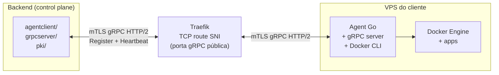
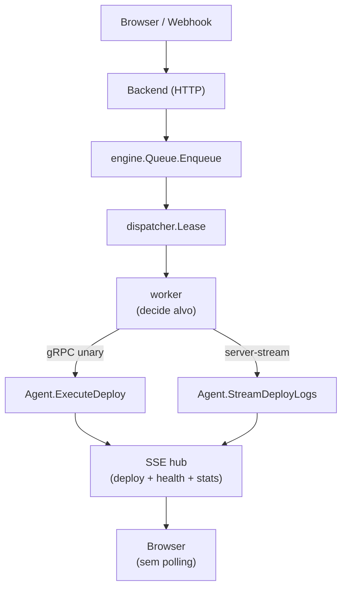

# Arquitetura de Deploy Remoto (Agente gRPC + mTLS)

Este documento descreve como o FlowDeploy executa deploys e comandos em
servidores remotos (VPSs) atraves de um **agente Go leve** instalado em cada
maquina, controlado pelo backend via **gRPC sobre mTLS**.

> Para o passo a passo operacional (cadastrar VPS, provisionar, debugar)
> consulte [`REMOTE_SERVER_TUTORIAL.md`](./REMOTE_SERVER_TUTORIAL.md).
>
> Para a visao geral da plataforma consulte [`ARCHITECTURE.md`](./ARCHITECTURE.md).

## 1. Por que gRPC + mTLS

| Aspecto         | REST / WebSocket                  | gRPC (escolha do FlowDeploy)        |
| --------------- | --------------------------------- | ----------------------------------- |
| Protocolo       | JSON sobre HTTP                   | Protobuf binario sobre HTTP/2       |
| Contrato        | Documentado a parte               | `.proto` versionado e gerado        |
| Streaming       | WebSocket separado                | Bidirecional nativo (logs, exec)    |
| Tipagem         | Manual                            | Forte, gerada para Go               |
| Autenticacao    | TLS + token                       | mTLS (certificados mutuos)          |
| Cancelamento    | Implementacao manual              | `context.Context` end-to-end        |

A combinacao gRPC + mTLS resolve em uma unica camada autenticacao do agente,
autenticacao do backend, integridade do canal e controle fino de cancelamento
(necessario para streams longos como `StreamDeployLogs` e `ExecContainer`).

## 2. Topologia

- O backend roda dois servidores gRPC: um interno (registro do agente) e o
  cliente que chama o agente para operacoes (deploy, listar containers, etc.).
- O agente roda **um** servidor gRPC e um cliente que apenas chama
  `Register` e `Heartbeat` no backend.
- Traefik publica a porta gRPC do backend via TCP route SNI, o que permite
  reusar o mesmo hostname publico (HTTPS para o painel + HTTP/2 para o gRPC).

## 3. Componentes

### 3.1 Backend (`apps/backend/internal`)

| Pacote          | Responsabilidade                                                                                    |
| --------------- | --------------------------------------------------------------------------------------------------- |
| `pki/`          | Autoridade certificadora interna; emite e renova certificados de agente                             |
| `grpcserver/`   | Servidor gRPC para `Register` e `Heartbeat`; valida certificado contra a CA                         |
| `agentclient/`  | Cliente gRPC para chamar agentes (deploy, containers, exec, imagens, redes, volumes, healthcheck)   |
| `agentdownload/`| Serve binarios do agente para auto-update (`/internal/agent/download`)                              |
| `provisioner/`  | Provisionamento via SSH: instala Docker, Traefik, agente e ativa o `systemd unit`                   |
| `engine/`       | Worker decide se deploy roda local (host) ou remoto (via `agentclient`)                             |

### 3.2 Agente (`apps/agent/internal`)

| Pacote                | Responsabilidade                                                              |
| --------------------- | ----------------------------------------------------------------------------- |
| `agent/`              | Inicializa configuracao, registra-se no backend, mantem heartbeat             |
| `grpcserver/`         | Servidor gRPC dividido por feature (containers, deploy, exec, images, ...)    |
| `deploy/`             | Executor de deploy: clona repo, faz `docker build`, sobe `compose`, healthcheck |
| `cleanup/`            | Scheduler de `docker prune` periodico                                         |

### 3.3 Contrato

O contrato vive em `apps/proto/flowdeploy/v1/agent.proto` e e gerado para Go
via `buf generate`. Resumo dos RPCs principais:

| RPC                                | Tipo               | Uso                                       |
| ---------------------------------- | ------------------ | ----------------------------------------- |
| `Register`                         | unary              | Agente anuncia ID, versao e metadata      |
| `Heartbeat`                        | unary              | Manter o servidor `online` no painel      |
| `ExecuteDeploy`                    | unary              | Backend dispara um novo deploy            |
| `StreamDeployLogs`                 | server-streaming   | Backend assina logs do deploy em tempo real |
| `ListContainers` / `Get*` / `Stop*`| unary              | Operacoes de gestao de containers         |
| `GetContainerLogs`                 | server-streaming   | Logs do container em tempo real           |
| `GetContainerStats`                | server-streaming   | CPU/memoria/rede em tempo real            |
| `ExecContainer`                    | bidirectional      | Terminal interativo (PTY via `creack/pty`)|
| `PushUpdate`                       | client-streaming   | Backend envia novo binario do agente      |
| `RunContainerHealthcheck`          | unary              | Forca health check de um container        |
| `ConfigureContainerSSL`            | unary              | Aplica TLS via Traefik para o container   |

> Mudancas no `.proto` sao **breaking** se removerem ou renumerarem campos.
> Sempre rodar `buf breaking --against '.git#branch=main'` antes de commitar.

## 4. Camada de seguranca (mTLS)

1. O backend gera, na primeira execucao, um par CA (chave + certificado) e
   grava-os criptografados na tabela `pki_ca` (migracao `000014`).
2. Quando uma VPS e cadastrada e provisionada:
   - O backend gera um par cliente para o agente, assinado pela CA.
   - O backend gera tambem o certificado servidor da propria VPS.
   - Tudo e enviado via SSH durante o provisionamento.
3. Em cada chamada gRPC:
   - O agente apresenta seu certificado (cliente).
   - O backend pina a CA e verifica o `Common Name` contra o `server_id`.
   - O agente, por sua vez, valida o certificado do backend pela mesma CA.
4. Renovacao: certificados tem validade configuravel; o backend re-emite e
   envia para o agente via `PushUpdate`/script de rotacao.

> Nenhum agente fala com outro agente. Todo o controle e centralizado no
> backend (control plane).

## 5. Lifecycle de um deploy remoto

Etapas internas dentro do agente (`apps/agent/internal/deploy`):

1. `git clone` (ou `git fetch + checkout`) usando token GitHub fornecido pelo
   backend.
2. Validacao do `paasdeploy.json` (incluindo `workdir` para monorepos).
3. `docker compose build` (ou `docker build` + `docker run`), sempre via
   `shared/pkg/executor` com argumentos explicitos.
4. `docker compose up -d` com labels Traefik gerados pelo backend (dominios,
   path prefixes, certificados).
5. Health check baseado em `/health` ou comando custom; retries configuraveis.
6. Em caso de falha: `compose down` da nova versao + `compose up` da anterior
   (rollback automatico).
7. Resposta final ao backend via stream + atualizacao da tabela `deploys`.

## 6. Auto-update do agente

Para evitar manutencao manual em cada VPS:

1. Operador sobe nova versao do binario no backend (atualiza `AGENT_VERSION` e
   builda).
2. Backend serve o binario via `agentdownload`.
3. Quando um agente faz `Heartbeat`, o backend compara versoes; se houver
   atualizacao, o backend chama `PushUpdate` (client-streaming) enviando o
   binario em chunks.
4. Agente:
   - Recebe os chunks, valida hash, grava em arquivo temporario.
   - Substitui o binario, reescreve a unidade `systemd` se necessario,
     reinicia-se via `systemctl restart paasdeploy-agent`.
5. Apos o restart, agente reabre conexao gRPC e refaz `Register` com a nova
   versao.

A migracao `000025_add_server_agent_update_mode` controla se o servidor
aceita auto-update automatico ou se exige aprovacao manual.

## 7. Provisionamento via SSH

Resumo do fluxo executado por `internal/provisioner/ssh_provisioner.go`:

1. Conectar via SSH (chave gerada pelo backend ou senha temporaria).
2. Validar e gravar `SSH_HOST_KEY` (TOFU + persistencia em `servers.ssh_host_key`).
3. Detectar privilegios: rodar como `root` ou usar `sudo` com senha temporaria.
4. Instalar Docker Engine + Compose v2 (idempotente: pula se ja instalado).
5. Criar a rede Docker `paasdeploy_net`.
6. Instalar Traefik no proprio VPS quando `acme_email` esta configurado
   (cada VPS gerencia o proprio TLS para os apps que ali rodam).
7. Subir o binario do agente para `~/paasdeploy-agent/`.
8. Criar a unidade `systemd` `paasdeploy-agent.service` com flags:
   `--server-addr`, `--server-id`, `--ca-cert`, `--cert`, `--key`, `--agent-port`.
9. Habilitar e iniciar o servico.
10. Verificar que o agente fez `Register` no backend antes de sinalizar
    sucesso para a UI.

## 8. Observabilidade

- Logs estruturados (`log/slog`) tanto no backend quanto no agente.
- O backend correlaciona logs com `serverId`, `deployId` e `appId`.
- Stats via `GetSystemMetrics`/`GetContainerStats` alimentam o monitor
  `server_stats_monitor` que emite eventos SSE para o painel.

## 9. Falhas comuns e diagnostico

| Sintoma                                        | Causa provavel                                     | Onde olhar                          |
| ---------------------------------------------- | -------------------------------------------------- | ----------------------------------- |
| Servidor preso em `provisioning`               | SSH key invalida ou Docker indisponivel            | logs do backend (passo `step=docker`)|
| Agente nunca aparece como `online`             | Porta gRPC nao publicada ou Traefik sem TCP route   | `traefik.yml`, `iptables`, firewall |
| `mTLS handshake failure`                       | Certificado expirado ou CA divergente              | tabela `pki_ca`, regenerar cert     |
| Deploy falha em `git clone`                    | Token GitHub App expirou ou permissao incorreta    | `git_token_provider.go`, GitHub App |
| Healthcheck falha apos build                   | App nao expoe `/health` no port mapeado            | `paasdeploy.json` + container logs  |
| `ExecContainer` desconecta                     | Proxy intermediario corta HTTP/2 sem ping          | configuracao do proxy / Traefik     |
| Auto-update falha                              | Permissao em `/usr/local/bin/` ou systemd ausente  | logs do agente, `systemctl status`  |

## 10. Decisoes de design

- **Sem fila distribuida** — o backend e a unica fonte de verdade; agentes nao
  conversam entre si. Isso simplifica deploy/atualizacao e mantem auditoria
  centralizada.
- **Idempotencia forte** — `ExecuteDeploy` aceita o mesmo `(app_id, sha)` mais
  de uma vez sem efeitos colaterais (ja persistido no banco com dedup).
- **Streams sao primeira classe** — logs e exec usam streams nativos; SSE so
  aparece no frontend, nao no protocolo agente.
- **Zero dependencia em DBs externos no agente** — agente nao usa banco, nao
  usa Redis. Estado unico em memoria + arquivos `systemd`.
- **Operacao e o produto** — provisionamento, atualizacao, rollback e cleanup
  sao funcionalidades de primeira classe, nao scripts ad-hoc.

## 11. Onde mexer ao evoluir

| Mudanca                              | Arquivos                                                          |
| ------------------------------------ | ----------------------------------------------------------------- |
| Novo RPC                             | `apps/proto/flowdeploy/v1/agent.proto` + buf generate + impl em `apps/agent/internal/grpcserver` + chamada em `apps/backend/internal/agentclient` |
| Nova etapa de deploy                 | `apps/agent/internal/deploy/` + atualizar SSE event types         |
| Mudanca em mTLS / rotacao            | `apps/backend/internal/pki/` + provisionador                      |
| Novo passo de provisionamento        | `apps/backend/internal/provisioner/ssh_provisioner.go`            |
| Novo evento no painel                | adicionar tipo em `internal/handler/sse_handler.go`               |
