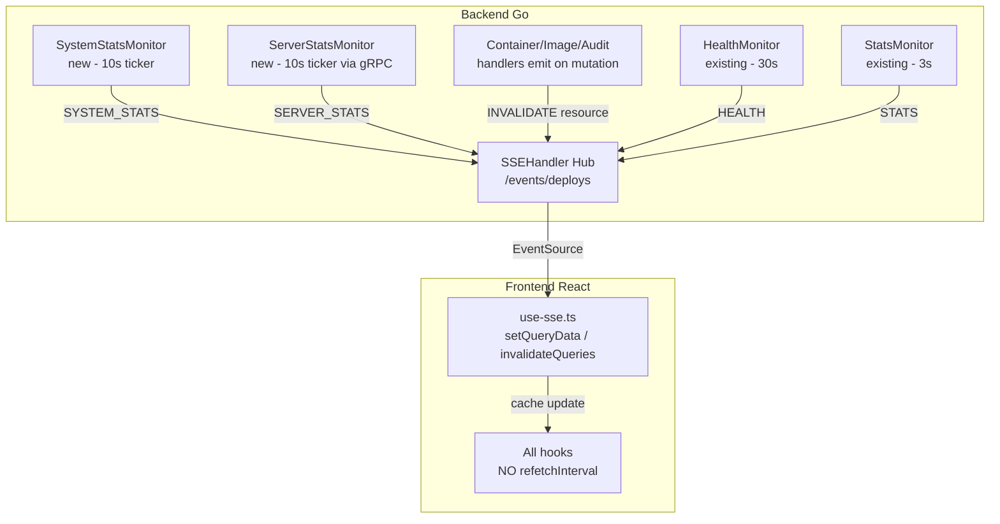

# Zero Polling: Migracao completa para SSE

## Diagnostico

11 instancias de `refetchInterval` no frontend fazem requisicoes HTTP periodicas (5s a 30s). O backend ja tem um hub SSE robusto (`/events/deploys`) que emite `health`, `stats`, deploy, provision e agent update events - mas faltam eventos para **system stats**, **server stats**, **containers** e demais recursos. O frontend, mesmo onde ja recebe SSE, continua fazendo polling redundante.

## Polling ativo no frontend (a ser eliminado)

- `use-server-stats.ts` -> `GET /servers/:id/stats` a cada 15s
- `use-local-server-stats.ts` -> `GET /system/stats` a cada 15s
- `useContainers` -> `GET /containers?all=true` a cada 10s
- `useContainerLogs` -> `GET /containers/:id/logs` a cada 5s
- `useImages` -> `GET /images` a cada 30s
- `useDanglingImages` -> `GET /images/dangling` a cada 30s
- `useAuditLogs` -> `GET /audit/logs` a cada 30s
- `useWebhookPayloads` -> `GET /audit/webhook-payloads` a cada 30s
- `useMigrationStatus` -> `GET /migration/status` a cada 10s
- certificates (`domain-manager.tsx`) -> `GET /certificates` a cada 30s
- containers (`server-details.tsx`) -> `GET /containers?all=true&serverId` a cada 30s

---

## Phase 1: Backend - Extend SSE event types

**`apps/backend/internal/handler/sse_handler.go`**

- Add `SSESystemStats` struct (wraps `sysinfo.SystemInfo` + `sysinfo.SystemMetrics`)
- Add to `SSEEvent`: fields `SystemStats *SSESystemStats`, `Resource string`
- Add methods: `EmitSystemStats()`, `EmitServerStats()`, `EmitInvalidate()`, `EmitInvalidateForServer()`
- Update both `switch` blocks (Stream + sendRecentEvents) with new cases:
  - `"SYSTEM_STATS"` -> `"system_stats"`
  - `"SERVER_STATS"` -> `"server_stats"`
  - `"INVALIDATE"` -> `"invalidate"`

---

## Phase 2: Backend - System Stats Monitor (new file)

**Create `apps/backend/internal/engine/system_stats_monitor.go`**

- Reads local system stats via `sysinfo.GetStats()` every 10s
- Emits `SYSTEM_STATS` via `SSEHandler.EmitSystemStats()`
- Pattern: same as existing `StatsMonitor` (Start/Stop/run with ticker)

---

## Phase 3: Backend - Server Stats Monitor (new file)

**Create `apps/backend/internal/engine/server_stats_monitor.go`**

- Every 10s: `serverRepo.FindAll()` -> filter online servers -> parallel gRPC calls (`GetSystemInfo` + `GetSystemMetrics`) -> `SSEHandler.EmitServerStats(serverID, stats)`
- 5s timeout per server to avoid blocking
- Pattern: same Start/Stop/run as other monitors

---

## Phase 4: Backend - Wire monitors into DI and startup

- **`apps/backend/internal/di/providers.go`**: Add `SystemStatsMonitor` and `ServerStatsMonitor` to `Application` struct
- **`apps/backend/internal/di/providers_engine.go`**: Add provider functions
- **`apps/backend/cmd/api/main.go`**: Start/stop both monitors alongside engine

---

## Phase 5: Backend - Emit invalidation events on mutations

Wherever backend modifies a resource, call `sseHandler.EmitInvalidate("resource_name")`:

- **`container_handler.go`**: After Start/Stop/Restart/Remove/Create -> `EmitInvalidate("containers")`
- **`container_health_handler.go`**: After container operations -> `EmitInvalidate("containers")`
- **Image handler**: After Remove/Prune -> `EmitInvalidate("images")`
- **`audit_service.go`**: After `Log()` -> `EmitInvalidate("audit-logs")`
- **Webhook handler**: After SavePayload -> `EmitInvalidate("webhook-payloads")`
- **Certificate handler**: After cert operations -> `EmitInvalidate("certificates")`
- **Migration handler**: After backup/migrate/rollback -> `EmitInvalidate("migration-status")`
- **`main.go`** `processEvent`: After `EventTypeSuccess`/`EventTypeFailed` -> `EmitInvalidate("containers")` + `EmitInvalidate("images")`

---

## Phase 6: Frontend - Add new SSE event types and handlers

**`apps/frontend/src/types/server.ts`**

- Add `"SYSTEM_STATS" | "SERVER_STATS" | "INVALIDATE"` to `SSEEventType`
- Add `systemStats?: ServerStats` and `resource?: string` to `SSEEvent`

**`apps/frontend/src/services/sse.ts`**

- Add `"system_stats"`, `"server_stats"`, `"invalidate"` to `SSE_EVENT_NAMES`

**`apps/frontend/src/hooks/use-sse.ts`**

- Add handlers for `SYSTEM_STATS` (setQueryData `["system","stats"]`), `SERVER_STATS` (setQueryData `["servers",serverId,"stats"]`), `INVALIDATE` (invalidateQueries by resource name)

---

## Phase 7: Frontend - Remove ALL polling

Remove `refetchInterval` from every hook. Keep `refetchOnWindowFocus: true`.

- `use-server-stats.ts`: Remove `refetchInterval`
- `use-local-server-stats.ts`: Remove `refetchInterval`
- `use-containers.ts`: Remove `refetchInterval` from both queries
- `use-images.ts`: Remove `refetchInterval` from both hooks
- `use-audit.ts`: Remove `refetchInterval` from both hooks
- `use-migration.ts`: Remove `refetchInterval`
- `domain-manager.tsx`: Remove `refetchInterval` from certificates query
- `server-details.tsx`: Remove `refetchInterval` from containers overview

---

## Phase 8: Frontend - Cleanup

**`apps/frontend/src/constants/query-config.ts`**

- Remove `REFETCH_INTERVALS` export entirely. Keep `STALE_TIMES` and `GC_TIMES`.

---

## Files summary

- **Backend new (2):** `system_stats_monitor.go`, `server_stats_monitor.go`
- **Backend modified (~10):** `sse_handler.go`, `main.go`, `providers.go`, `providers_engine.go`, `container_handler.go`, `container_health_handler.go`, image handler, `audit_service.go`, webhook/migration/certificate handlers
- **Frontend modified (~11):** `server.ts`, `sse.ts`, `use-sse.ts`, `use-server-stats.ts`, `use-local-server-stats.ts`, `use-containers.ts`, `use-images.ts`, `use-audit.ts`, `use-migration.ts`, `domain-manager.tsx`, `server-details.tsx`, `query-config.ts`
